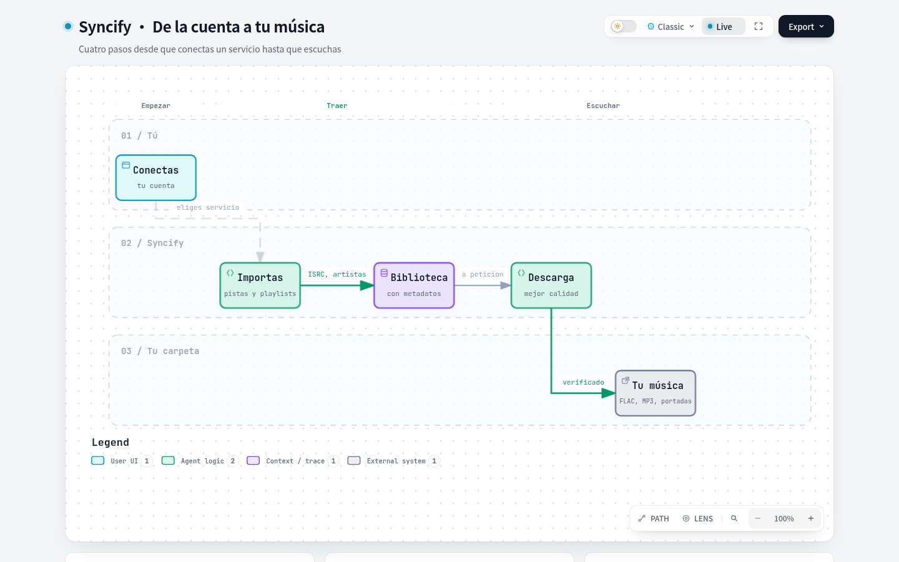
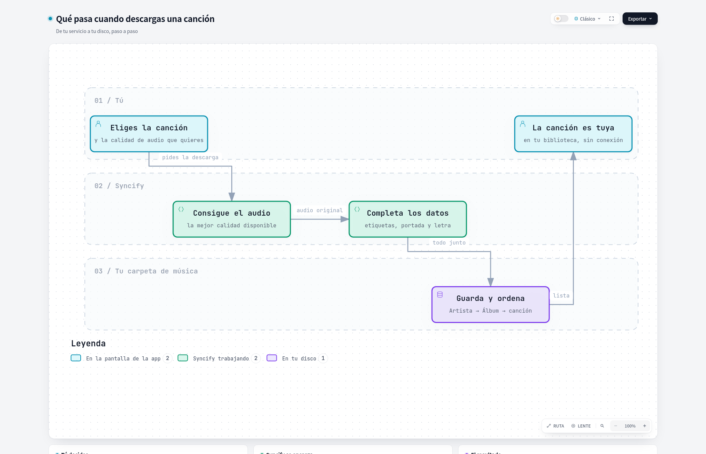
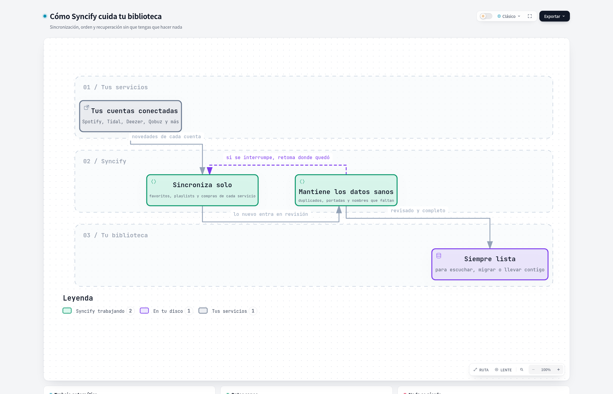
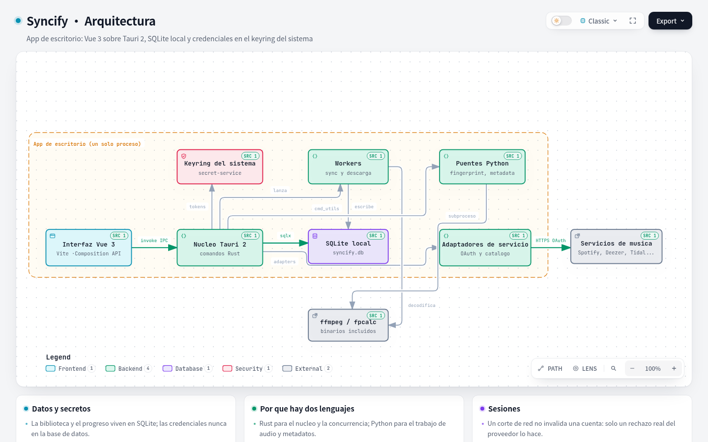

<div align="center">

# Syncify

**Toda tu biblioteca musical. Máxima calidad. Bajo tu control.**

Conecta Qobuz, Tidal, Spotify, Deezer, SoundCloud y Apple Music. Importa tu
biblioteca, descárgala en la mejor calidad disponible y conserva una
biblioteca local perfectamente organizada, con archivos reales, lista para
Symfonium, Plexamp o cualquier reproductor que quieras.

[English](README.md) · [Español](README.es.md)

**[⬇ Descarga la última versión](https://github.com/MadManJohnSmith/Syncify/releases/latest)**
· [Compila desde fuente](#compilar-desde-fuente) · [Documentación](docs/README.md)

[](https://github.com/MadManJohnSmith/Syncify/releases/latest)
[](https://github.com/MadManJohnSmith/Syncify/actions/workflows/ci.yml)
[](https://tauri.app/)
[](https://www.rust-lang.org/)
[](https://vuejs.org/)
[](https://tailwindcss.com/)
[](https://www.sqlite.org/)

**Windows** instalador y portable · **Linux** AppImage, DEB y tarball

</div>

---

## Véalo en acción


| | |
|---|---|
|  |  |
| *Todo tu catálogo, unificado* | *Letras sincronizadas, guardadas como .lrc* |
|  |  |
| *Un motor de descargas que controlas* | *Un login por servicio, todo queda sincronizado* |

---

## ¿Por qué Syncify?

Los servicios de streaming te alquilan la música. Si te vas — o el servicio
pierde una licencia, o quitan una pista — tu biblioteca se va contigo. Syncify
le da la vuelta: convierte "tu" catálogo en *tu* catálogo.

- **Cambia de servicio sin dejar tu música atrás.** Importa tus favoritos,
  álbumes, artistas y playlists — más compras e historial de escucha cuando el
  proveedor los expone — y migra a otro servicio, o descárgalo y sé dueño de
  verdad. La cobertura no es idéntica en todos los proveedores; la
  [matriz de paridad de importación](docs/MATRIZ_PARIDAD_IMPORTACION.md) tiene
  la verdad servicio por servicio.
- **Archivos reales, no licencias.** Las descargas quedan como FLAC
  correctamente etiquetado (hasta Hi-Res 24-bit/192 kHz) o MP3, verificado
  contra lo que el proveedor prometió.
- **Una biblioteca, todos los servicios.** Una sola importación reúne en una
  biblioteca deduplicada todos los servicios que conectes, y el motor
  reconoce la misma canción venga de donde venga. Marcar una pista como
  favorita dentro de Syncify es una marca **local**: tus cuentas solo se
  escriben desde la herramienta de migración, no desde la vista de biblioteca.

## ¿Qué puedes hacer con Syncify?

- **Importa tu biblioteca** de Qobuz, Tidal, Spotify, Deezer, SoundCloud y
  Apple Music — pistas, álbumes, artistas y playlists. No es la misma
  profundidad en todos: la API pública de SoundCloud no expone playlists ni
  historial, Deezer no expone historial de escucha, y el importador de Apple
  Music lee tu biblioteca de favoritos en vez de tu historial. La
  [matriz de paridad](docs/MATRIZ_PARIDAD_IMPORTACION.md) es la referencia
  exacta.
- **Migra entre servicios**: elige origen, elige destino, revisa las
  coincidencias y transfiere. Syncify primero empareja por ISRC y después por
  título y artista, y transfiere lo que encuentra como **favoritos en la
  cuenta de destino**. Aún no reconstruye tus playlists allí.
- **Descarga con cascada de calidad**: el motor siempre apunta al mejor
  nivel ofrecido para cada pista, baja al siguiente cuando no está y
  verifica cada archivo que escribe.
- **Metadatos de nivel profesional automáticos**: artistas múltiples,
  colaboraciones y compilaciones bien resueltas, países, BPM, tonalidad y
  energía — desde MusicBrainz, AcoustID y Last.fm.
- **Letras sincronizadas como `.lrc`**, resueltas con una cascada de 16
  estrategias sobre 10 proveedores.
- **Portadas en alta resolución** (incluidas animadas) guardadas junto a tu
  música, organizadas en carpetas por artista y álbum bajo `~/Music/Syncify`.
- **Manténla sana**: deduplicación y fusión, auditorías de identidad del
  catálogo, chequeos de integridad y un pipeline de reparación con historial
  auditable.
- **Playlists inteligentes** con reglas, construidas sobre tu propia
  biblioteca.

## Cómo funciona

1. **Conecta una cuenta.** La app abre un flujo de login seguro por servicio
   (OAuth/captura de sesión en el navegador) y guarda tus credenciales
   cifradas en tu máquina.
2. **Importa.** Un motor unificado en Rust recorre la API del servicio con
   paginación, resuelve la identidad canónica de cada pista (ISRC, IDs del
   proveedor), la enriquece y la persiste transaccionalmente, con retry,
   en tu biblioteca SQLite local.
3. **Descarga.** Pipelines nativos manejan el formato de entrega de cada
   proveedor — Qobuz sirve URL directas de FLAC y Tidal entrega flujos
   segmentados que el pipeline ensambla — y escriben archivos FLAC/MP3 reales
   con metadatos, portadas y letras embebidas, y verifican que lo que
   aterrizó en disco coincide con lo prometido.
4. **Disfrútala donde quieras.** El resultado es un árbol de carpetas plano
   con archivos sidecar — sin encierro propietario. Apunta Symfonium,
   Plexamp, Roon o cualquier reproductor y funciona.

Bajo el capó: una app de escritorio **Tauri 2** (núcleo Rust + UI en Vue 3)
con IPC tipado, un motor de descarga/reparación multihilo y un esquema local
endurecido a lo largo de **83 migraciones SQL**. Los logins de servicios
corren por puentes Python pequeños y auditados (Playwright, Mutagen, AcoustID).

### Cómo encaja todo

Cada tarjeta es un diagrama vivo — ábrelo para pasar el ratón, arrastrar y ampliar.

<table width="100%">
<tr>
  <td width="50%" valign="top">
    <a href="https://madmanjohnsmith.github.io/Syncify/docs/diagrams/user-journey.html"></a>
    <p align="center"><a href="https://madmanjohnsmith.github.io/Syncify/docs/diagrams/user-journey.html"><b>De la cuenta a tu música</b></a> — lo que Syncify hace por ti</p>
  </td>
  <td width="50%" valign="top">
    <a href="https://madmanjohnsmith.github.io/Syncify/docs/diagrams/download-journey.html"></a>
    <p align="center"><a href="https://madmanjohnsmith.github.io/Syncify/docs/diagrams/download-journey.html"><b>Qué pasa cuando descargas</b></a> — de tu servicio a tu disco, paso a paso</p>
  </td>
</tr>
<tr>
  <td width="50%" valign="top">
    <a href="https://madmanjohnsmith.github.io/Syncify/docs/diagrams/library-care.html"></a>
    <p align="center"><a href="https://madmanjohnsmith.github.io/Syncify/docs/diagrams/library-care.html"><b>Tu biblioteca, cuidada</b></a> — sincronización, orden y recuperación solos</p>
  </td>
  <td width="50%" valign="top">
    <a href="https://madmanjohnsmith.github.io/Syncify/docs/diagrams/architecture.html"></a>
    <p align="center"><a href="https://madmanjohnsmith.github.io/Syncify/docs/diagrams/architecture.html"><b>Bajo el capó</b></a> — cómo encajan las piezas (para los curiosos)</p>
  </td>
</tr>
</table>

Diagramas en español: [de la cuenta a tu música](docs/diagrams/user-journey.html) · [qué pasa cuando descargas](docs/diagrams/download-journey.html) · [tu biblioteca, cuidada](docs/diagrams/library-care.html) · [bajo el capó](docs/diagrams/architecture.html)

## Servicios soportados

| | Favoritos | Álbumes/Artistas | Playlists | Historial | Destino de migración |
|---|---|---|---|---|---|
| **Qobuz** | ✅ | ✅ | ✅ | ✅ | ✅ |
| **Tidal** | ✅ | ✅ | ✅ | ✅ | ✅ |
| **Spotify** | ✅ | ✅ | ✅ | ✅ | ✅ |
| **Deezer** | ✅ | ✅ | ✅ | — ⁽¹⁾ | ✅ |
| **SoundCloud** | ✅ | ✅ ⁽²⁾ | — ⁽¹⁾ | — ⁽¹⁾ | ✅ |
| **Apple Music** | ✅ ⁽³⁾ | ✅ ⁽³⁾ | ✅ | — | ✅ |

⁽¹⁾ La API pública del proveedor no lo expone — Syncify avisa en vez de fingir.
⁽²⁾ Se derivan del `publisher_metadata` de cada like; la API no tiene endpoint de álbumes favoritos.
⁽³⁾ Apple Music importa por su propio importador fiel al ISRC (storefront
configurable); el camino del motor unificado está documentado en la matriz
de paridad.

La matriz completa y honesta por fase vive en
[`docs/MATRIZ_PARIDAD_IMPORTACION.md`](docs/MATRIZ_PARIDAD_IMPORTACION.md).

## Instalación

Descarga la última build de la página de
[**Releases**](https://github.com/MadManJohnSmith/Syncify/releases):

| Plataforma | Archivos |
|---|---|
| **Windows** | `Syncify_*_x64-setup.exe` (instalador) · `Syncify-Windows-Portable.zip` |
| **Linux** | `*.AppImage` · `*.deb` · `Syncify-Linux-x86_64.tar.gz` (binario crudo + puentes) |

Después:

1. Instala y abre Syncify: `ffmpeg`, `ffprobe` y `fpcalc` (Chromaprint)
   **viajan dentro de cada paquete**, igual que un runtime de Python privado
   con los puentes de servicios ya instalados — no hay nada más que
   descargar, instalar ni configurar.
2. Corre el asistente de primera ejecución: conecta tus cuentas, elige tu
   carpeta de música, listo. Las credenciales se cifran y se guardan en la
   base de datos SQLite propia de Syncify, dentro de la carpeta de perfil de
   la app. La clave de cifrado vive en el llavero de tu sistema operativo
   cuando hay uno disponible, y si no (Linux sin sesión gráfica, sin Secret
   Service) cae a un archivo `.crypto_key` con permisos `0600` en esa misma
   carpeta de perfil.

> ¿Compilando desde fuente? Mira
> [`src-tauri/binaries/README.md`](src-tauri/binaries/README.md) para saber
> cómo se proveen los binarios empaquetados en builds locales de producción.

## Preguntas frecuentes

**¿Sobrevive mi biblioteca si desinstalo Syncify?**

Sí. Las descargas son archivos FLAC/MP3 en carpetas normales, con portadas y
letras `.lrc` como sidecars. Ninguna base de datos propietaria las mantiene
juntas: Symfonium, Plexamp, Roon o cualquier reproductor las lee
directamente.

**¿Dónde viven las credenciales de mis servicios?**

Cifradas dentro de la base de datos SQLite propia de Syncify, en la carpeta
de perfil de la app en tu máquina. La clave de cifrado se guarda en el
llavero de tu sistema operativo cuando hay uno disponible; donde no lo hay
(Linux sin sesión gráfica, sin Secret Service), la clave cae a un archivo
`.crypto_key` con permisos `0600` en esa misma carpeta de perfil. Cada login
corre por tu navegador y ninguna credencial se escribe nunca en un archivo de
configuración plano.

**¿Qué calidad puedo esperar?**

El motor apunta al mejor nivel que cada servicio ofrezca (FLAC hasta Hi-Res
24-bit/192 kHz) y baja de nivel pista por pista. Cada archivo se verifica
contra lo que el proveedor prometió antes de darse por bueno.

**¿Hay versión para macOS?**

Todavía no. Windows (instalador y portable) y Linux (AppImage, DEB, tarball)
son las plataformas soportadas hoy.

## Compilar desde fuente

Requisitos: **Rust** (estable), **Node.js 20+**, **Python 3.11+** y `ffmpeg`,
`flac` y `fpcalc` en tu `PATH`. En Linux además necesitas los paquetes de
desarrollo de WebKit2GTK/GTK (`libwebkit2gtk-4.1-dev`, `libgtk-3-dev`,
`libayatana-appindicator3-dev`, `librsvg2-dev`).

```bash
git clone https://github.com/MadManJohnSmith/Syncify.git
cd Syncify

# CLI de Tauri (raíz del repo) + dependencias del frontend
npm install
cd ui && npm ci && cd ..

# Puentes Python (logins de servicios, metadatos, fingerprinting)
python3 -m venv .venv
source .venv/bin/activate
pip install -r scripts/requirements.txt
playwright install chromium

# Modo desarrollo (con recarga en caliente de la UI)
npm run dev

# Build de producción (instalador para tu SO)
npm run build
```

## Documentación

- [`docs/`](docs/README.md) — arquitectura y features · [índice en inglés](docs/README.en.md)
- [`docs/MATRIZ_PARIDAD_IMPORTACION.md`](docs/MATRIZ_PARIDAD_IMPORTACION.md) — matriz viva de paridad de importación
- [`docs/LYRICS_16_PROVIDER_MATRIX.md`](docs/LYRICS_16_PROVIDER_MATRIX.md) — la cascada de letras, auditada
- [`docs/Deuda_Tecnica_y_UX.md`](docs/Deuda_Tecnica_y_UX.md) — deuda técnica abierta, rastreada a la vista

## Contribuir

Las contribuciones son bienvenidas: bugs, mejoras de UI, nuevos proveedores
de letras o metadatos, más servicios, documentación. Haz fork, crea una rama
enfocada y abre un PR contra `main` — la rama de integración sobre la que
corre CI y de la que salen las releases.
[`CONTRIBUTING.md`](CONTRIBUTING.md) tiene los comandos exactos de los checks,
las rutas que CI ignora y cómo mantener los docs al día con el código.

¿Encontraste un bug? [Abre un issue](https://github.com/MadManJohnSmith/Syncify/issues)
con tu SO/versión, pasos para reproducir y logs relevantes — nunca
credenciales ni tokens personales.

## Licencia

Este repositorio no concede actualmente una licencia de uso, copia,
modificación o redistribución. Todos los derechos están reservados por sus
titulares. Antes de cualquier distribución pública se definirá y versionará
una licencia explícita.

---

<div align="center">

<sub>Sincroniza · Descarga · Organiza — <a href="README.md">English version</a></sub>

</div>
