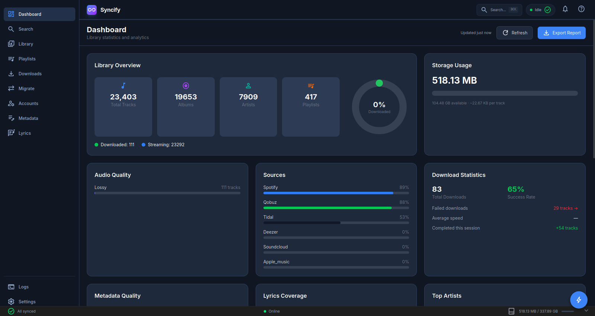
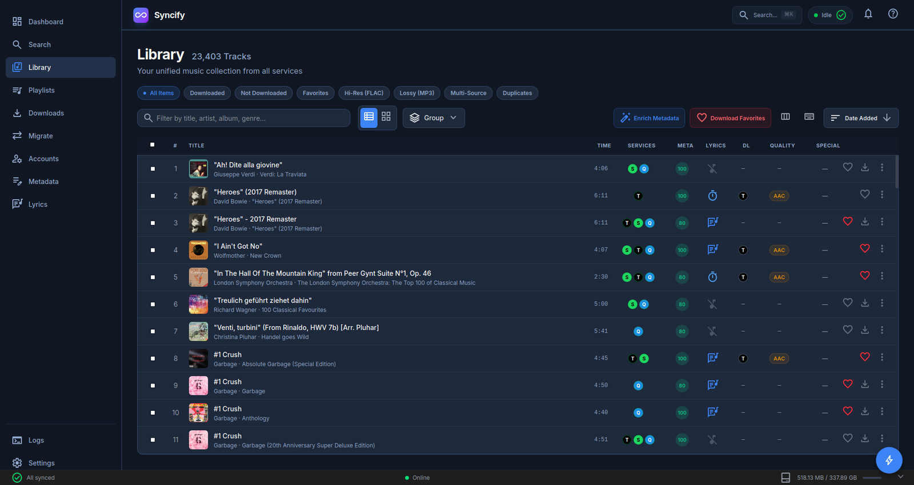
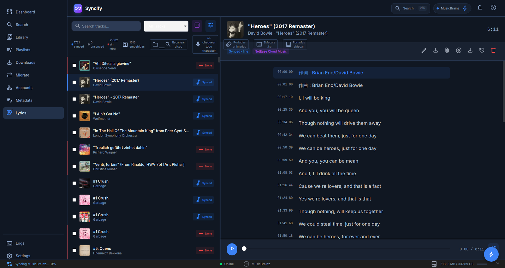
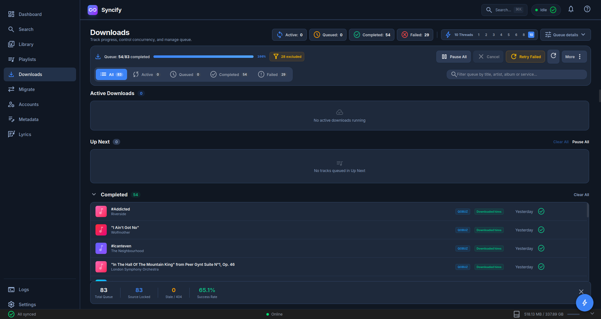
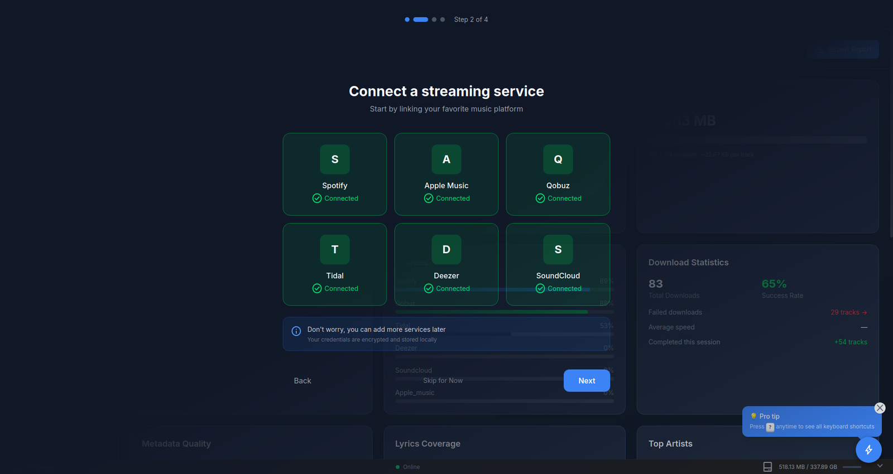

<div align="center">

# Syncify

**Your entire music library. Maximum quality. Under your control.**

Connect Qobuz, Tidal, Spotify, Deezer, SoundCloud and Apple Music. Import
your whole catalog, download it in the best quality available, and keep a
perfectly organized local library of real files, ready for Symfonium,
Plexamp, or any player you love.

[English](README.md) · [Español](README.es.md)

**[⬇ Download the latest release](https://github.com/MadManJohnSmith/Syncify/releases/latest)**
· [Build from source](#building-from-source) · [Documentation](docs/README.md)

[](https://github.com/MadManJohnSmith/Syncify/releases/latest)
[](https://github.com/MadManJohnSmith/Syncify/actions/workflows/ci.yml)
[](https://tauri.app/)
[](https://www.rust-lang.org/)
[](https://vuejs.org/)
[](https://tailwindcss.com/)
[](https://www.sqlite.org/)

**Windows** installer & portable · **Linux** AppImage, DEB & tarball

</div>

---

## See it in action



| | |
|---|---|
|  |  |
| *Your whole catalog, unified* | *Synced lyrics, saved as .lrc sidecars* |
|  |  |
| *A download engine you control* | *One login per service, everything stays in sync* |

---

## Why Syncify?

Streaming services rent you your music. If you leave — or a service loses a
license, or a track gets delisted — your library goes with it. Syncify flips
that: it turns "your" catalog into *your* catalog.

- **Leave any service without leaving your music behind.** Import everything
  (favorites, playlists, purchases, history), then migrate it to another
  service, or download it and own it outright.
- **Own real files, not licenses.** Downloads land as properly tagged FLAC
  (up to Hi-Res 24-bit/192 kHz) or MP3, verified against what the provider
  promised.
- **One library, every service.** Favorites stay in sync both ways across the
  services you use, with smart deduplication that knows when two services
  have the same song.

## What can you do with it?

- **Import your full catalog** from Qobuz, Tidal, Spotify, Deezer, SoundCloud
  and Apple Music — tracks, albums, artists, playlists.
- **Migrate between services**: pick a source, pick a destination, review the
  matches, transfer. Your playlists move with their order and names intact.
- **Download with a quality cascade**: the engine always targets the best
  tier a track is offered in, steps down to the next one when it isn't, and
  verifies every file it writes.
- **Get professional-grade metadata automatically**: multi-value artists,
  collaborations, compilations handled correctly, countries, BPM, musical
  key and energy — from MusicBrainz, AcoustID and Last.fm.
- **Synced lyrics as `.lrc` sidecars**, resolved through a 16-strategy
  cascade across 10 providers.
- **High-resolution covers** (including animated ones) saved next to your
  music, organized in artist/album folders under `~/Music/Syncify`.
- **Keep it healthy**: duplicate detection and merge, catalog identity
  audits, integrity checks and a repair pipeline with full audit history.
- **Smart playlists** with rule-based filters, built on your own library.

## How it works

1. **Connect an account.** The app opens a secure login flow per service
   (browser-based OAuth/session capture) and stores your credentials
   encrypted on your machine.
2. **Import.** A unified Rust engine walks the service API with pagination,
   resolves every track's canonical identity (ISRC, provider IDs), enriches
   it, and persists it transactionally, with retry, into your local
   SQLite library.
3. **Download.** Native pipelines handle each provider's delivery format
   (including DASH decryption for Qobuz), write real FLAC/MP3 files with the
   metadata, covers and lyrics embedded, and verify what landed on disk
   matches what was promised.
4. **Enjoy anywhere.** The result is a plain folder tree with sidecar files
   — no proprietary database lock-in. Point Symfonium, Plexamp, Roon or any
   player at it and it just works.

Under the hood: a **Tauri 2** desktop app (Rust core + Vue 3 UI) with a typed
IPC layer, a multi-threaded download/repair engine, and a local schema
hardened across **83 SQL migrations**. Service logins run through small
audited Python bridges (Playwright, Mutagen, AcoustID).

### Diagrams

Both are interactive standalone HTML — open them in a browser, follow the path,
and zoom into any part.

| | |
|---|---|
| **Architecture**<br>How a Vue 3 UI, a Rust core, SQLite, the system keyring and the Python bridges fit together — and where your credentials actually live. | **Gated release**<br>Why a version tag can't be moved or deleted before CI is green on that exact commit. |
| [EN](docs/diagrams/architecture.en.html) · [ES](docs/diagrams/architecture.html) | [EN](docs/diagrams/release-gated.en.html) · [ES](docs/diagrams/release-gated.html) |

**Architecture** — the UI talks to the Rust core over typed IPC; the core owns
the SQLite library and talks to the system keyring, so credentials never land in
the database. Workers and service adapters run alongside it, and Python bridges
handle audio and metadata work through `cmd_utils`, which resolves their paths
for whatever packaging you installed (AppImage, installer, or source checkout).

**Gated release** — `main` requires a pull request with all three CI checks
green, and a reusable gate refuses to publish unless the exact commit passed CI
and the tag doesn't already point somewhere else. Version tags `v*` can't be
updated or deleted.

### How it comes together

These are interactive — hover, pan and zoom inside them.

<details open>
<summary><b>From account to music</b> — what Syncify actually does for you</summary>

<iframe src="docs/diagrams/user-journey.en.html" width="100%" height="430" style="border:1px solid #d0d7de;border-radius:8px;margin-top:12px" title="Syncify user journey"></iframe>

</details>

<details>
<summary><b>Under the hood</b> — how the pieces fit (for the curious)</summary>

<iframe src="docs/diagrams/architecture.en.html" width="100%" height="480" style="border:1px solid #d0d7de;border-radius:8px;margin-top:12px" title="Syncify architecture"></iframe>

</details>

Español: [de la cuenta a tu música](docs/diagrams/user-journey.html) · [bajo el capó](docs/diagrams/architecture.html)

## Supported services

| | Favorites | Albums/Artists | Playlists | History | Migration target |
|---|---|---|---|---|---|
| **Qobuz** | ✅ | ✅ | ✅ | ✅ | ✅ |
| **Tidal** | ✅ | ✅ | ✅ | ✅ | ✅ |
| **Spotify** | ✅ | ✅ | ✅ | ✅ | ✅ |
| **Deezer** | ✅ | ✅ | ✅ | — ⁽¹⁾ | ✅ |
| **SoundCloud** | ✅ | ✅ ⁽²⁾ | — ⁽¹⁾ | — ⁽¹⁾ | ✅ |
| **Apple Music** | ✅ ⁽³⁾ | ✅ ⁽³⁾ | ✅ | — | ✅ |

⁽¹⁾ Not exposed by the provider's public API — Syncify warns instead of pretending.
⁽²⁾ Derived from each like's publisher metadata; the API has no favorites-albums endpoint.
⁽³⁾ Apple Music imports through its own ISRC-faithful importer (storefront
configurable); the unified-engine path is documented in the parity matrix.

The full, honest per-phase matrix lives in
[`docs/MATRIZ_PARIDAD_IMPORTACION.md`](docs/MATRIZ_PARIDAD_IMPORTACION.md).

## Installation

Grab the latest build from the
[**Releases**](https://github.com/MadManJohnSmith/Syncify/releases) page:

| Platform | Files |
|---|---|
| **Windows** | `Syncify_*_x64-setup.exe` (installer) · `Syncify-Windows-Portable.zip` |
| **Linux** | `*.AppImage` · `*.deb` · `Syncify-Linux-x86_64.tar.gz` (raw binary + bridges) |

Then:

1. Install and launch Syncify: `ffmpeg`, `ffprobe` and `fpcalc` (Chromaprint)
   **ship inside every package**, so there is nothing else to download,
   install or configure.
2. Run the first-run wizard: connect your accounts (credentials are stored in
   your OS keyring — no config files needed), pick your music folder, done.

> Building from source? See
> [`src-tauri/binaries/README.md`](src-tauri/binaries/README.md) for how the
> bundled binaries are provided to local production builds.

## FAQ

**Does my library survive uninstalling Syncify?**

Yes. Downloads are plain FLAC/MP3 files in normal folders, with covers and
`.lrc` lyrics as sidecars. No proprietary database holds them together, so
Symfonium, Plexamp, Roon or any player reads them directly.

**Where do my service credentials live?**

In your operating system's keyring, encrypted on your machine. Each login
runs through your browser; nothing is written to plain config files.

**What quality can I expect?**

The engine targets the best tier each service offers (FLAC up to Hi-Res
24-bit/192 kHz) and falls back to lower tiers per track. Every file is
verified against what the provider promised before it counts as done.

**Is there a macOS version?**

Not yet. Windows (installer and portable) and Linux (AppImage, DEB,
tarball) are the supported platforms today.

## Building from source

Requirements: **Rust** (stable), **Node.js 20+**, **Python 3.11+**, and
`ffmpeg`, `flac` and `fpcalc` on your `PATH`. On Linux you also need the
WebKit2GTK/GTK dev packages (`libwebkit2gtk-4.1-dev`, `libgtk-3-dev`,
`libayatana-appindicator3-dev`, `librsvg2-dev`).

```bash
git clone https://github.com/MadManJohnSmith/Syncify.git
cd Syncify

# Tauri CLI (repo root) + frontend dependencies
npm install
cd ui && npm ci && cd ..

# Python bridges (service logins, metadata, fingerprinting)
python3 -m venv .venv
source .venv/bin/activate
pip install -r scripts/requirements.txt
playwright install chromium

# Run in development (with hot UI reload)
npm run dev

# Production build (installer for your OS)
npm run build
```

## Documentation

- [`docs/`](docs/README.md) — architecture and feature docs
- [`docs/MATRIZ_PARIDAD_IMPORTACION.md`](docs/MATRIZ_PARIDAD_IMPORTACION.md) — the living import-parity matrix
- [`docs/LYRICS_16_PROVIDER_MATRIX.md`](docs/LYRICS_16_PROVIDER_MATRIX.md) — the lyrics cascade, audited
- [`docs/Deuda_Tecnica_y_UX.md`](docs/Deuda_Tecnica_y_UX.md) — open technical debt, tracked in the open

## Contributing

Contributions are welcome: bugs, UI improvements, new lyrics or metadata
providers, more services, docs. Fork the repo, create a focused branch, and
open a PR against `syncify-app` (the development branch; `main` receives
verified merges for releases). Run the checks before submitting —
`cargo check`, `cargo test`, `cargo clippy`, `cargo fmt --check` and
`cd ui && npm run test:run` — the CI runs exactly those.

Found a bug? [Open an issue](https://github.com/MadManJohnSmith/Syncify/issues)
with your OS/version, steps to reproduce, and relevant logs — never personal
credentials or tokens.

## License

This repository does not currently grant a license for use, copying,
modification or redistribution. All rights are reserved by their holders.
An explicit license will be defined and versioned before any public
distribution.

---

<div align="center">

<sub>Sincroniza · Descarga · Organiza — <a href="README.es.md">Versión en español</a></sub>

</div>
