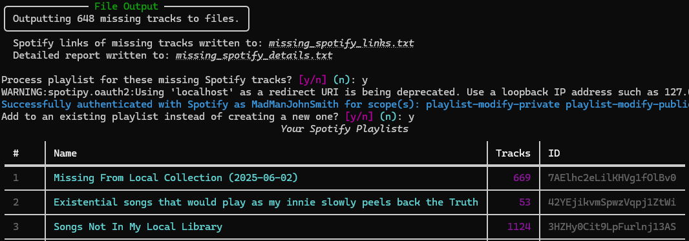
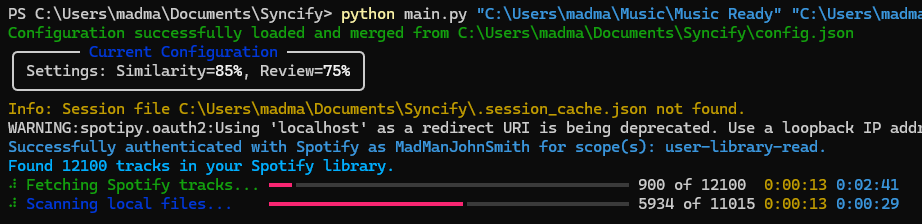

# Syncify - Spotify Library & Local Music Helper

Syncify is a Python tool designed to help you manage and synchronize your Spotify "Liked Songs" library with your local music collection(s). It identifies discrepancies, helps you find missing tracks, and can manage Spotify playlists based on these findings.

## Features

* **Compare Libraries:** Compares your Spotify "Liked Songs" with one or more local music directories.
* **Identify Missing Tracks:**
    * Finds Spotify songs that are missing from your local collection.
    * (Optional) Finds local songs ("orphans") that are not in your Spotify "Liked Songs" and searches for them on Spotify.
* **Fuzzy Matching:** Uses flexible string matching (fuzzywuzzy) to compare titles and artists, with configurable similarity thresholds.
* **Manual Review:** Provides an interactive step to review uncertain matches, with bulk actions (yes/no/skip all).
* **Version Detection:** Identifies and annotates potential version differences (e.g., Live, Remix, Remastered) between matched Spotify and local tracks.
    
* **Output Reports:**
    * Generates a text file with Spotify links of missing songs from your local library.
    * Generates a detailed TSV (tab-separated values) file with URLs, titles, artists, albums, and notes for missing or annotated songs.
    
* **Playlist Management:**
    * Creates a new Spotify playlist for Spotify songs missing locally.
    * Optionally adds these missing songs to one of your existing Spotify playlists.
    * **Playlist Cleaning:** If adding to an existing playlist, can optionally remove tracks from that playlist which are now found in your local library.
    * Prevents adding duplicate tracks if they already exist in the target playlist.
    
* **Local Orphan Processing:**
    * If enabled, searches Spotify's full catalog for your local "orphan" tracks.
    * Displays potential matches.
    * Allows you to add a selected Spotify match to your "Liked Songs" or a specific playlist (new or existing).
* **Multiple Local Directories:** Supports scanning music files from several local folders at once.
* **Advanced Normalization:** Uses configurable text normalization rules (via `config.json`) to improve matching accuracy.
* **Session Caching:** Saves processed Spotify and local track data to a local cache file (`.session_cache.json`) by default, significantly speeding up subsequent runs.
* **Command-Line Interface (CLI):** Offers various options to customize behavior:
    * Specify local music directories.
    * Adjust similarity and review thresholds.
    * Verbose mode for detailed logging.
    * Session file management (`--session-file`, `--force-rescan`, `--no-save-session`).
    * Dry run mode (`--dry-run`) to simulate Spotify modifications without making actual changes.
    * Orphan processing actions (`--process-orphans`, `--orphan-playlist-name`).
* **Enhanced Console UI:** Uses the `rich` library for clear progress bars, tables, and styled text output.
    
* **File Logging:** Logs operations and errors to `spotify_checker.log` for diagnostics.
* **Configuration Files:**
    * `.env`: For your Spotify API credentials.
    * `config.json`: For script behavior, normalization patterns, and default settings.

## Prerequisites

* Python 3.9 or higher.
* A Spotify Premium account (required by the Spotify API for some actions like controlling playback, but for library access and playlist modification, a free account *might* work for some features, though Premium is generally assumed for full API access) At this moment it fully works with a free account, but i can't garantee that it will work when you try.

## Setup Instructions

1.  **Clone or Download the Repository:**
    ```bash
    # Using Git
    git clone https://github.com/MadManJohnSmith/Syncify.git
    cd Syncify 
    ```
    Or [Download](https://github.com/MadManJohnSmith/Syncify.git) the ZIP and extract it.

2.  **Set up a Python Virtual Environment (Recommended):**
    ```bash
    python -m venv venv
    # Windows
    venv\Scripts\activate
    # macOS/Linux
    source venv/bin/activate
    ```

3.  **Install Dependencies:**
    Make sure you are in the project's root directory (`Syncify/`) where `requirements.txt` is located.
    ```bash
    pip install -r requirements.txt
    ```

4.  **Spotify Developer App Setup:**
    * Go to the [Spotify Developer Dashboard](https://developer.spotify.com/dashboard/).
    * Log in and create a new App (e.g., name it "SyncifyApp").
    * Note down your **Client ID** and **Client Secret**.
    * In your App's settings on the dashboard, add a **Redirect URI**. For local scripts, `http://localhost:8888/callback` is common. **The URI must exactly match what you put in the `.env` file.**

5.  **Create the `.env` File:**
    * In the project's root directory (`Syncify/`), create a file named `.env`.
    * You can copy `.env.example` to `.env` and then fill it in.
    * Add your Spotify credentials:
        ```ini
        SPOTIPY_CLIENT_ID='CLIENT_ID_SPOTIFY'
        SPOTIPY_CLIENT_SECRET='CLIENT_SECRET_SPOTIFY'
        SPOTIPY_REDIRECT_URI='http://localhost:8888/callback' 
        ```
        Replace the placeholders with your actual credentials and the exact Redirect URI you set in the Spotify Dashboard.

6.  **Create/Review the `config.json` File:**
    * A `config.json` file in the project's root directory (`Syncify/`) allows you to customize various script behaviors.
    * If it doesn't exist, the script will use internal defaults (which match the example below). You can create it to override these defaults.
    * **Example `config.json` content:**
        ```json
        {
          "normalization_patterns_to_remove_str": [
            "\\(official video\\)", 
            "\\[hq\\]",
            "\\(lyrics\\)"
          ],
          "version_keywords": [
            "live", "acoustic", "remix", "remastered", "edit", 
            "version", "deluxe", "extended", "instrumental", "unplugged",
            "radio edit", "club mix"
          ],
          "supported_formats": [".mp3", ".flac", ".m4a", ".wav", ".ogg"],
          "output_links_file": "missing_spotify_links.txt",
          "output_details_file": "missing_spotify_details.txt",
          "default_playlist_name_template": "Missing From {} ({})",
          "default_similarity_threshold": 85,
          "default_review_threshold": 75,
          "requests_timeout_connect": 15,
          "requests_timeout_read": 45,
          "api_max_retries": 3,
          "api_initial_retry_delay": 5
        }
        ```
    * `normalization_patterns_to_remove_str`: List of regex patterns to remove from titles/artists before matching.
    * `version_keywords`: Keywords used to identify different song versions.
    * `supported_formats`: Audio file extensions to scan locally.
    * `output_..._file`: Default names for output files.
    * `default_playlist_name_template`: Template for new playlists (uses folder name and date).
    * `default_..._threshold`: Default fuzzy matching thresholds.
    * `requests_timeout_*`, `api_max_retries`, `api_initial_retry_delay`: Network request parameters.

## Execution Instructions

1.  Ensure your virtual environment is activated (if you created one).
2.  Navigate to the project's root directory (`Syncify/`) in your terminal.
3.  Run the script using `python main.py` followed by the path(s) to your local music director(y/ies) and any desired options.

**Basic Command:**
```bash
python main.py "/ruta/a/tu/musica_principal"
```

# Syncify Documentation

## Multiple Local Music Directories

You can specify multiple music directories by listing paths separated by spaces. For paths that contain spaces, make sure to enclose them in quotes.

### Examples

**Linux/macOS (Bash):**
```bash
python main.py "/path/to/music_1" "/another/path with spaces/music_2" "/media/drive/music_3"
```

**Windows Command Prompt:**
```cmd
python main.py "C:\Music\Collection A" "D:\Audio Archive\Lossless"
```

**Windows PowerShell:**
```powershell
python main.py 'C:\Music\Collection A' 'D:\Audio Archive\Lossless'
```

## Command Line Options

### Threshold Settings
- `--threshold <0-100>`: Set the main similarity threshold for matching (default is from config.json or 85)
- `--review-threshold <0-100>`: Set the threshold for songs that need manual review (default is from config.json or 75)

### Logging and Output
- `-v` or `--verbose`: Enable detailed console output and DEBUG level logging to the log file

### Session Management
- `--force-rescan`: Ignores any cached session data and fetches fresh info from Spotify and your local files
- `--no-save-session`: Disables saving the processed data to the session cache file for this run
- `--session-file <path/to/session.json>`: Specify a custom path for the session cache file (default is `.session_cache.json` in the project directory)

### Testing and Safety
- `--dry-run`: Simulates Spotify actions (like playlist creation/modification) without actually making changes. Highly recommended for first runs or when testing new settings

### Orphan Processing
- `--process-orphans [action]`: Processes local tracks not found in your Spotify Liked Songs
  - If only `--process-orphans` is given, or with `display`: Searches Spotify and shows potential matches
  - `add-to-liked`: Prompts to add a selected match to your Liked Songs
  - `add-to-playlist`: Prompts to add a selected match to a new or existing playlist
- `--orphan-playlist-name <name>`: Default name for a new playlist created when processing orphans with `add-to-playlist` action

### Example with Multiple Options

```bash
python main.py "D:\Music\Collection1" "E:\Music\FLACs" --threshold 90 --review-threshold 80 --process-orphans add-to-liked --dry-run -v
```

## First Run & Authentication

The first time you run the script (or if your authentication token expires or you change requested permissions for Spotify actions), your web browser will open automatically. You'll be asked to log in to Spotify and authorize the application.

After authorization, Spotify will redirect you to a URL (e.g., `http://localhost:8888/callback` or whatever you configured). Copy this entire URL from your browser's address bar (it will look like `http://localhost:8888/callback?code=AQC...&state=...`) and paste it back into the terminal when prompted.

## Output Files

The following files are generated in the project directory by default:

- **`missing_spotify_links.txt`**: A simple list of Spotify URLs for songs identified as missing from your local library
- **`missing_spotify_details.txt`**: A tab-separated file with more details (URL, Title, Artists, Album, Notes) for missing songs and songs with version annotations or review decisions
- **`spotify_checker.log`**: A log file with information about the script's execution, including verbose details (if `-v` is used) and any errors
- **`.session_cache.json`** (default name): Caches processed track data from Spotify and your local library to speed up future runs

## Troubleshooting

### No client_id error / Authentication Error
- Ensure your `.env` file is correctly set up in the project root directory (`Syncify/`)
- Verify `SPOTIPY_CLIENT_ID`, `SPOTIPY_CLIENT_SECRET`, and `SPOTIPY_REDIRECT_URI` are correct
- The `SPOTIPY_REDIRECT_URI` in `.env` must exactly match one of the Redirect URIs registered in your Spotify Developer Dashboard application settings

### Read timed out errors
- This can happen with an unstable internet connection or slow Spotify API responses
- The script has a built-in retry mechanism
- You can also try increasing `requests_timeout_read` (e.g., to 60) in your `config.json` file

### ModuleNotFoundError
- Make sure you have installed all dependencies listed in `requirements.txt` into your active Python virtual environment
- Run `pip install -r requirements.txt` again if unsure

### Import Errors related to spotify_sync_lib
- Ensure you are running `python main.py` from the root directory of the project (`Syncify/`)

---

## Requirements File

**`requirements.txt`**
```text
spotipy>=2.23.0
python-dotenv>=1.0.0
rich>=13.0.0
tinytag>=1.8.0
fuzzywuzzy>=0.18.0
python-Levenshtein>=0.12.0
requests>=2.25.0
```

## Environment Configuration

**`.env.example`** (Rename this to `.env` and complete it)

```ini
SPOTIPY_CLIENT_ID='YOUR_SPOTIFY_CLIENT_ID_HERE'
SPOTIPY_CLIENT_SECRET='YOUR_SPOTIFY_CLIENT_SECRET_HERE'
SPOTIPY_REDIRECT_URI='http://localhost:8888/callback'
```
