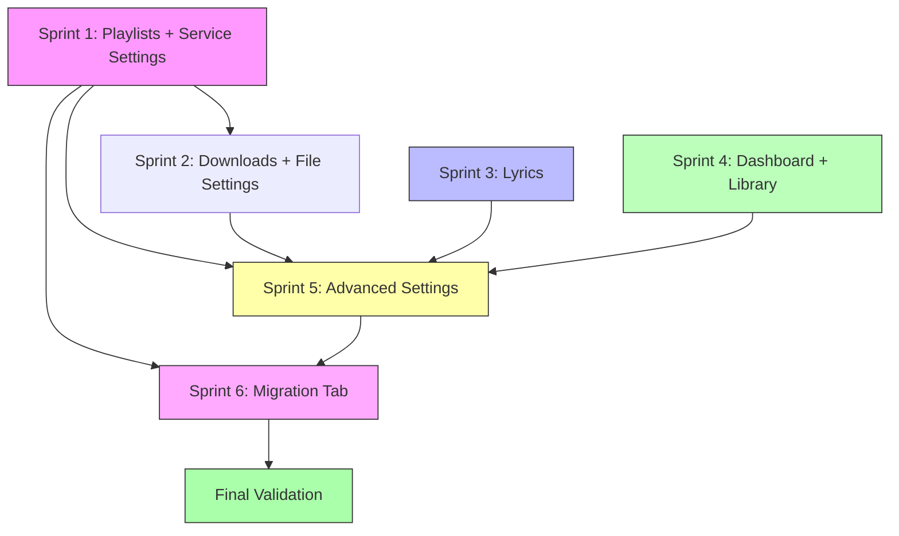

# Syncify Implementation Plan (Pending Work)

> **Organization**: Feature-bundled sprints with related settings. Each sprint is a shippable unit.

---

## Executive Summary

### Sprint Overview

| Sprint | Focus | Settings Bundled | Duration | Dependencies |
|--------|-------|------------------|----------|--------------|
| **1** | Playlists + Sync | Service prefs, Sync/scheduling | 2 weeks | None |
| **2** | Downloads + Files | Quality caps, Folder templates, Duplicates, Audio | 1.5 weeks | Sprint 1 |
| **3** | Lyrics | Lyrics providers, Lyrics config | 2 weeks | None (parallel) |
| **4** | Dashboard + Library | Snapshots migration only | 1 week | None (parallel) |
| **5** | Advanced & Polish | Logging, workers, cache, diagnostics | 1 week | All above |
| **6** | Migration Tab | Migration history, templates, matching | 1.5 weeks | Sprint 1 (services) |

### Sprint Parallelization

```
Week 1-2:  Sprint 1 (Playlists)  ─────────────────────┐
                                                       ├──► Sprint 5 (Week 6)
Week 2-4:  Sprint 2 (Downloads) ──────────────────────┤       │
                                                       │       ▼
Week 1-3:  Sprint 3 (Lyrics)     ═══════════════════════┤   Sprint 6 (Week 6-7)
                                                       │       │
Week 3-4:  Sprint 4 (Dashboard)  ═══════════════════════┘       ▼
                                                          Final Validation
```

### Dependency Diagram



### Status Legend
- ✅ Implemented & Tested
- 🟡 In Progress
- 🔴 Not Started
- ⏸️ Blocked/Deferred

---

## Migration Index

| Migration | Sprint | Purpose | Status |
|-----------|--------|---------|--------|
| 0001-0008 | - | Existing schema | ✅ Applied |
| 0009 | 4 | Historical Snapshots (Dashboard) | 🔴 Pending |
| 0010 | 1 | Service Preferences & Priorities | 🔴 Pending |
| 0011 | 1 | Sync Settings & Service Sync | 🔴 Pending |
| 0012 | 2 | Quality & Format Settings | 🔴 Pending |
| 0013 | 2 | Folder Template & File Naming | 🔴 Pending |
| 0014 | 2 | Duplicate Settings | 🔴 Pending |
| 0015 | 2 | Audio Processing Settings | 🔴 Pending |
| 0016 | 3 | Lyrics Provider Settings | 🔴 Pending |
| 0017 | 3 | Lyrics Config | 🔴 Pending |
| 0018 | 5 | Advanced Settings | 🔴 Pending |
| 0019 | 6 | Migration History & Templates | 🔴 Pending |

> **Note**: Always check actual `/migrations/` folder before creating new migrations.

---

## Definition of Done (per feature)

- [ ] Migration applied (if any)
- [ ] Rust command implemented & registered in `main.rs`
- [ ] TypeScript types match Rust structs exactly
- [ ] API wrapper function exported from `/api/`
- [ ] UI wired with loading, error, and empty states
- [ ] `cargo check` passes
- [ ] `npx vue-tsc --noEmit` passes
- [ ] Manual smoke test completed

---

# 🟣 Sprint 1: Playlists + Service Settings (Week 1-2)

> **Why Together**: Playlist import needs to know *which services* to pull from and *when to auto-sync*.

## Status: 🔴 Not Started

---

## 1.1 Database Migrations

### Migration 0010: Service Preferences

```sql
-- 0010_service_preferences.sql
CREATE TABLE IF NOT EXISTS service_preferences (
    id INTEGER PRIMARY KEY AUTOINCREMENT,
    service_name TEXT NOT NULL UNIQUE,
    priority INTEGER NOT NULL DEFAULT 0,
    auto_import_enabled BOOLEAN NOT NULL DEFAULT FALSE,
    created_at TEXT DEFAULT CURRENT_TIMESTAMP,
    updated_at TEXT DEFAULT CURRENT_TIMESTAMP
);

-- Seed defaults (order matters for priority)
INSERT OR IGNORE INTO service_preferences (service_name, priority, auto_import_enabled) VALUES
    ('spotify', 1, FALSE),
    ('qobuz', 2, FALSE),
    ('tidal', 3, FALSE),
    ('deezer', 4, FALSE),
    ('soundcloud', 5, FALSE);

CREATE INDEX IF NOT EXISTS idx_service_prefs_priority ON service_preferences(priority);

-- Rollback:
-- DROP INDEX IF EXISTS idx_service_prefs_priority;
-- DROP TABLE IF EXISTS service_preferences;
```

### Migration 0011: Sync Settings

```sql
-- 0011_sync_settings.sql
CREATE TABLE IF NOT EXISTS sync_settings (
    id INTEGER PRIMARY KEY CHECK (id = 1),
    auto_sync_enabled BOOLEAN NOT NULL DEFAULT FALSE,
    sync_interval_value INTEGER NOT NULL DEFAULT 60,
    sync_interval_unit TEXT NOT NULL DEFAULT 'minutes',
    sync_on_startup BOOLEAN NOT NULL DEFAULT FALSE,
    background_download BOOLEAN NOT NULL DEFAULT TRUE,
    max_concurrent_downloads INTEGER NOT NULL DEFAULT 3,
    rate_limit_delay_ms INTEGER NOT NULL DEFAULT 500,
    updated_at TEXT DEFAULT CURRENT_TIMESTAMP
);

-- Singleton row
INSERT OR IGNORE INTO sync_settings (id) VALUES (1);

CREATE TABLE IF NOT EXISTS service_sync_settings (
    id INTEGER PRIMARY KEY AUTOINCREMENT,
    service_name TEXT NOT NULL UNIQUE,
    sync_favorites BOOLEAN NOT NULL DEFAULT TRUE,
    sync_playlists BOOLEAN NOT NULL DEFAULT TRUE,
    sync_albums BOOLEAN NOT NULL DEFAULT FALSE,
    incremental_sync BOOLEAN NOT NULL DEFAULT TRUE,
    last_synced TEXT
);

-- Seed per-service sync settings
INSERT OR IGNORE INTO service_sync_settings (service_name) VALUES
    ('spotify'), ('qobuz'), ('tidal'), ('deezer'), ('soundcloud');

-- Rollback:
-- DROP TABLE IF EXISTS service_sync_settings;
-- DROP TABLE IF EXISTS sync_settings;
```

---

## 1.2 Backend (Rust)

### Models (`src-tauri/src/models.rs`)

```rust
#[derive(Debug, Clone, Serialize, Deserialize, sqlx::FromRow)]
pub struct ServicePreference {
    pub id: i64,
    pub service_name: String,
    pub priority: i64,
    pub auto_import_enabled: bool,
}

#[derive(Debug, Clone, Serialize, Deserialize, sqlx::FromRow)]
pub struct SyncSettings {
    pub id: i64,
    pub auto_sync_enabled: bool,
    pub sync_interval_value: i64,
    pub sync_interval_unit: String,
    pub sync_on_startup: bool,
    pub background_download: bool,
    pub max_concurrent_downloads: i64,
    pub rate_limit_delay_ms: i64,
}

#[derive(Debug, Clone, Serialize, Deserialize, sqlx::FromRow)]
pub struct ServiceSyncSettings {
    pub id: i64,
    pub service_name: String,
    pub sync_favorites: bool,
    pub sync_playlists: bool,
    pub sync_albums: bool,
    pub incremental_sync: bool,
    pub last_synced: Option<String>,
}
```

### Commands (`src-tauri/src/commands.rs`)

**Service Preferences:**
- `get_service_preferences() -> Vec<ServicePreference>`
- `update_service_preference(service_name, auto_import_enabled) -> ServicePreference`
- `reorder_service_priorities(service_names: Vec<String>) -> Vec<ServicePreference>`

**Sync Settings:**
- `get_sync_settings() -> SyncSettings`
- `update_sync_settings(settings: SyncSettings) -> SyncSettings`
- `get_service_sync_settings() -> Vec<ServiceSyncSettings>`
- `update_service_sync_settings(service_name, settings) -> ServiceSyncSettings`

### DB Functions (`src-tauri/src/db.rs`) - Copy-Paste Ready

```rust
pub async fn get_service_preferences(pool: &SqlitePool) -> Result<Vec<ServicePreference>, sqlx::Error> {
    sqlx::query_as!(
        ServicePreference,
        "SELECT id, service_name, priority, auto_import_enabled FROM service_preferences ORDER BY priority ASC"
    )
    .fetch_all(pool)
    .await
}

pub async fn update_service_preference(
    pool: &SqlitePool,
    service_name: &str,
    auto_import_enabled: bool,
) -> Result<ServicePreference, sqlx::Error> {
    sqlx::query!(
        "UPDATE service_preferences SET auto_import_enabled = ?, updated_at = CURRENT_TIMESTAMP WHERE service_name = ?",
        auto_import_enabled, service_name
    )
    .execute(pool)
    .await?;
    
    sqlx::query_as!(
        ServicePreference,
        "SELECT id, service_name, priority, auto_import_enabled FROM service_preferences WHERE service_name = ?",
        service_name
    )
    .fetch_one(pool)
    .await
}

pub async fn reorder_service_priorities(
    pool: &SqlitePool,
    service_names: &[String],
) -> Result<Vec<ServicePreference>, sqlx::Error> {
    for (index, name) in service_names.iter().enumerate() {
        sqlx::query!(
            "UPDATE service_preferences SET priority = ?, updated_at = CURRENT_TIMESTAMP WHERE service_name = ?",
            index as i32 + 1, name
        )
        .execute(pool)
        .await?;
    }
    get_service_preferences(pool).await
}

pub async fn get_sync_settings(pool: &SqlitePool) -> Result<SyncSettings, sqlx::Error> {
    sqlx::query_as!(
        SyncSettings,
        "SELECT id, auto_sync_enabled, sync_interval_value, sync_interval_unit, sync_on_startup, 
         background_download, max_concurrent_downloads, rate_limit_delay_ms FROM sync_settings WHERE id = 1"
    )
    .fetch_one(pool)
    .await
}

pub async fn update_sync_settings(pool: &SqlitePool, settings: &SyncSettings) -> Result<SyncSettings, sqlx::Error> {
    sqlx::query!(
        "UPDATE sync_settings SET auto_sync_enabled = ?, sync_interval_value = ?, sync_interval_unit = ?,
         sync_on_startup = ?, background_download = ?, max_concurrent_downloads = ?, rate_limit_delay_ms = ?,
         updated_at = CURRENT_TIMESTAMP WHERE id = 1",
        settings.auto_sync_enabled, settings.sync_interval_value, settings.sync_interval_unit,
        settings.sync_on_startup, settings.background_download, settings.max_concurrent_downloads,
        settings.rate_limit_delay_ms
    )
    .execute(pool)
    .await?;
    get_sync_settings(pool).await
}

pub async fn get_service_sync_settings(pool: &SqlitePool) -> Result<Vec<ServiceSyncSettings>, sqlx::Error> {
    sqlx::query_as!(
        ServiceSyncSettings,
        "SELECT id, service_name, sync_favorites, sync_playlists, sync_albums, incremental_sync, last_synced 
         FROM service_sync_settings"
    )
    .fetch_all(pool)
    .await
}

pub async fn update_service_sync_settings(
    pool: &SqlitePool,
    service_name: &str,
    sync_favorites: bool,
    sync_playlists: bool,
    sync_albums: bool,
    incremental_sync: bool,
) -> Result<ServiceSyncSettings, sqlx::Error> {
    sqlx::query!(
        "UPDATE service_sync_settings SET sync_favorites = ?, sync_playlists = ?, sync_albums = ?, 
         incremental_sync = ? WHERE service_name = ?",
        sync_favorites, sync_playlists, sync_albums, incremental_sync, service_name
    )
    .execute(pool)
    .await?;
    
    sqlx::query_as!(
        ServiceSyncSettings,
        "SELECT id, service_name, sync_favorites, sync_playlists, sync_albums, incremental_sync, last_synced 
         FROM service_sync_settings WHERE service_name = ?",
        service_name
    )
    .fetch_one(pool)
    .await
}
```

### Tauri Commands - Copy-Paste Ready

```rust
#[tauri::command]
pub async fn get_service_preferences(state: State<'_, AppState>) -> Result<Vec<ServicePreference>, String> {
    db::get_service_preferences(&state.db).await.map_err(|e| e.to_string())
}

#[tauri::command]
pub async fn update_service_preference(
    service_name: String,
    auto_import_enabled: bool,
    state: State<'_, AppState>,
) -> Result<ServicePreference, String> {
    db::update_service_preference(&state.db, &service_name, auto_import_enabled)
        .await
        .map_err(|e| e.to_string())
}

#[tauri::command]
pub async fn reorder_service_priorities(
    service_names: Vec<String>,
    state: State<'_, AppState>,
) -> Result<Vec<ServicePreference>, String> {
    db::reorder_service_priorities(&state.db, &service_names)
        .await
        .map_err(|e| e.to_string())
}

#[tauri::command]
pub async fn get_sync_settings(state: State<'_, AppState>) -> Result<SyncSettings, String> {
    db::get_sync_settings(&state.db).await.map_err(|e| e.to_string())
}

#[tauri::command]
pub async fn update_sync_settings(
    settings: SyncSettings,
    state: State<'_, AppState>,
) -> Result<SyncSettings, String> {
    db::update_sync_settings(&state.db, &settings).await.map_err(|e| e.to_string())
}

#[tauri::command]
pub async fn get_service_sync_settings(state: State<'_, AppState>) -> Result<Vec<ServiceSyncSettings>, String> {
    db::get_service_sync_settings(&state.db).await.map_err(|e| e.to_string())
}

#[tauri::command]
pub async fn update_service_sync_settings(
    service_name: String,
    sync_favorites: bool,
    sync_playlists: bool,
    sync_albums: bool,
    incremental_sync: bool,
    state: State<'_, AppState>,
) -> Result<ServiceSyncSettings, String> {
    db::update_service_sync_settings(&state.db, &service_name, sync_favorites, sync_playlists, sync_albums, incremental_sync)
        .await
        .map_err(|e| e.to_string())
}
```

**Register in `main.rs`:**
```rust
.invoke_handler(tauri::generate_handler![
    // ... existing
    get_service_preferences,
    update_service_preference,
    reorder_service_priorities,
    get_sync_settings,
    update_sync_settings,
    get_service_sync_settings,
    update_service_sync_settings,
])
```

---

## 1.3 Playlist Feature (Full)

### Existing Schema
Uses `0006_playlists.sql` (already applied): `playlists`, `playlist_tracks` tables.

### Backend Commands (12+)

**CRUD:**
- `get_playlists() -> Vec<Playlist>`
- `get_playlist(id) -> Playlist`
- `get_playlist_tracks_paginated(id, offset, limit) -> PlaylistTracksResult`
- `search_playlists(query) -> Vec<Playlist>`
- `create_playlist(name, description?) -> Playlist`
- `update_playlist(id, name?, description?) -> Playlist`
- `delete_playlist(id) -> bool`

**Track Management:**
- `add_tracks_to_playlist(playlist_id, track_ids) -> i64` (returns count)
- `remove_tracks_from_playlist(playlist_id, track_ids) -> i64`
- `reorder_playlist_tracks(playlist_id, track_ids_in_order) -> bool`

**Service Imports:**
- `import_spotify_playlists() -> ImportResult`
- `import_qobuz_playlists() -> ImportResult` (albums-as-playlists)
- `import_tidal_playlists() -> ImportResult`
- `import_deezer_playlists() -> ImportResult`
- `sync_playlist(playlist_id) -> SyncResult`

**Implementation Notes:**
- Follow existing Spotify import pattern in codebase
- Dedupe via ISRC-first matching using `get_or_create_track()`
- Emit progress events: `playlist-import-progress`
- SoundCloud: return explanatory error (uses "sets" not playlists)

### Frontend

**Types (`ui/src/api/types.ts`):**
```typescript
export interface Playlist {
    id: number;
    name: string;
    description: string | null;
    track_count: number;
    cover_art_url: string | null;
    source_service: string | null;
    created_at: string;
    updated_at: string;
}

export interface PlaylistTrack {
    id: number;
    track_id: number;
    position: number;
    added_at: string;
    title: string;
    artist_name: string | null;
    album_name: string | null;
    duration_ms: number | null;
    cover_art_url: string | null;
}
```

**API (`ui/src/api/playlists.ts`):**
- Export all CRUD functions
- Export import functions per service
- Export `playlistsApi` object

### Frontend API - Copy-Paste Ready

**Types (`ui/src/api/types.ts`):**

```typescript
// Service Settings Types
export interface ServicePreference {
    id: number
    service_name: string
    priority: number
    auto_import_enabled: boolean
}

export interface SyncSettings {
    id: number
    auto_sync_enabled: boolean
    sync_interval_value: number
    sync_interval_unit: string
    sync_on_startup: boolean
    background_download: boolean
    max_concurrent_downloads: number
    rate_limit_delay_ms: number
}

export interface ServiceSyncSettings {
    id: number
    service_name: string
    sync_favorites: boolean
    sync_playlists: boolean
    sync_albums: boolean
    incremental_sync: boolean
    last_synced: string | null
}
```

**API (`ui/src/api/settings.ts`):**

```typescript
import { invoke } from '@tauri-apps/api/core'
import type { ServicePreference, SyncSettings, ServiceSyncSettings } from './types'

// Service Preferences
export async function getServicePreferences(): Promise<ServicePreference[]> {
    return invoke<ServicePreference[]>('get_service_preferences')
}

export async function updateServicePreference(
    serviceName: string,
    autoImportEnabled: boolean
): Promise<ServicePreference> {
    return invoke<ServicePreference>('update_service_preference', {
        serviceName,
        autoImportEnabled
    })
}

export async function reorderServicePriorities(serviceNames: string[]): Promise<ServicePreference[]> {
    return invoke<ServicePreference[]>('reorder_service_priorities', { serviceNames })
}

// Sync Settings
export async function getSyncSettings(): Promise<SyncSettings> {
    return invoke<SyncSettings>('get_sync_settings')
}

export async function updateSyncSettings(settings: SyncSettings): Promise<SyncSettings> {
    return invoke<SyncSettings>('update_sync_settings', { settings })
}

export async function getServiceSyncSettings(): Promise<ServiceSyncSettings[]> {
    return invoke<ServiceSyncSettings[]>('get_service_sync_settings')
}

export async function updateServiceSyncSettings(
    serviceName: string,
    syncFavorites: boolean,
    syncPlaylists: boolean,
    syncAlbums: boolean,
    incrementalSync: boolean
): Promise<ServiceSyncSettings> {
    return invoke<ServiceSyncSettings>('update_service_sync_settings', {
        serviceName, syncFavorites, syncPlaylists, syncAlbums, incrementalSync
    })
}

// Export as namespace
export const settingsApi = {
    getServicePreferences,
    updateServicePreference,
    reorderServicePriorities,
    getSyncSettings,
    updateSyncSettings,
    getServiceSyncSettings,
    updateServiceSyncSettings,
}
```

**View (`ui/src/views/PlaylistView.vue`):**
- List view with search
- Create/edit/delete modals
- Drag-drop track reordering
- Import by URL dialog
- Track add/remove actions

---

## 1.4 Frontend - Settings UI

Wire the following in `SettingsView.vue`:

**Services & Priorities Tab:**
- Load `get_service_preferences()` on mount
- Drag-to-reorder with `reorder_service_priorities()`
- Toggle auto-import per service
- Visual priority indicators (1=highest)

**Sync & Scheduling Tab:**
- Load `get_sync_settings()` on mount
- Auto-sync toggle + interval selector (minutes/hours/days)
- Sync on startup toggle
- Per-service sync toggles (favorites/playlists/albums)
- Max concurrent downloads slider (1-5)
- Rate limit delay input

---

## 1.5 Testing

**Rust Tests (`src-tauri/tests/playlists_tests.rs`):**
- Create playlist
- List playlists
- Add tracks
- Reorder tracks
- Remove tracks
- Delete playlist
- Search playlists
- Update metadata

**Manual Smoke Test:**
1. Create a playlist, add tracks, reorder, verify persistence
2. Import from Spotify (if connected)
3. Change service priorities, restart app, verify order persists
4. Enable auto-sync, wait for interval, verify sync runs

---

## 1.6 Risks

| Risk | Impact | Mitigation |
|------|--------|------------|
| Service priority reorder breaks imports | High | Test all import flows after change |
| Auto-sync hammers API rate limits | High | Enforce min 5-minute intervals |
| Position drift on concurrent edits | Medium | Use optimistic locking with `updated_at` |
| Large playlist import timeout | Medium | Process in batches of 100 tracks |

---

## 1.7 Sprint 1 Checklist

- [ ] Apply migration 0010_service_preferences.sql
- [ ] Apply migration 0011_sync_settings.sql
- [ ] Implement service preference commands
- [ ] Implement sync settings commands
- [ ] Implement all playlist commands (12+)
- [ ] Register all commands in main.rs
- [ ] Add TypeScript types
- [ ] Create API wrappers
- [ ] Wire SettingsView - Services tab
- [ ] Wire SettingsView - Sync tab
- [ ] Wire PlaylistView completely
- [ ] Write Rust tests
- [ ] `cargo check` passes
- [ ] `npx vue-tsc --noEmit` passes
- [ ] Manual smoke test

---

# 🟢 Sprint 2: Downloads + File Settings (Week 2-4)

> **Why Together**: Download queue needs *quality caps*, *folder templates*, *duplicate handling*, and *audio processing* settings to know how to save files.

## Status: 🔴 Not Started

---

## 2.1 Database Migrations

### Migration 0012: Quality & Format Settings

```sql
-- 0012_quality_format_settings.sql
CREATE TABLE IF NOT EXISTS quality_preferences (
    id INTEGER PRIMARY KEY AUTOINCREMENT,
    service_name TEXT NOT NULL UNIQUE,
    max_quality TEXT NOT NULL DEFAULT 'lossless',
    preferred_format TEXT NOT NULL DEFAULT 'flac',
    fallback_quality TEXT NOT NULL DEFAULT 'high',
    fallback_format TEXT NOT NULL DEFAULT 'mp3'
);

INSERT OR IGNORE INTO quality_preferences (service_name, max_quality, preferred_format) VALUES
    ('spotify', 'high', 'ogg'),
    ('qobuz', 'hires', 'flac'),
    ('tidal', 'master', 'flac'),
    ('deezer', 'lossless', 'flac'),
    ('soundcloud', 'high', 'mp3');

-- Rollback:
-- DROP TABLE IF EXISTS quality_preferences;
```

### Migration 0013: Folder Template & File Naming

```sql
-- 0013_folder_file_naming.sql
CREATE TABLE IF NOT EXISTS folder_settings (
    id INTEGER PRIMARY KEY CHECK (id = 1),
    base_folder TEXT NOT NULL DEFAULT '',
    folder_template TEXT NOT NULL DEFAULT '{artist}/{album}',
    file_template TEXT NOT NULL DEFAULT '{track_number} - {title}',
    artist_separator TEXT NOT NULL DEFAULT ', ',
    replace_spaces_with TEXT,
    max_path_length INTEGER NOT NULL DEFAULT 255
);

INSERT OR IGNORE INTO folder_settings (id) VALUES (1);

-- Rollback:
-- DROP TABLE IF EXISTS folder_settings;
```

### Migration 0014: Duplicate Settings

```sql
-- 0014_duplicate_settings.sql
CREATE TABLE IF NOT EXISTS duplicate_settings (
    id INTEGER PRIMARY KEY CHECK (id = 1),
    enable_detection BOOLEAN NOT NULL DEFAULT TRUE,
    prefer_higher_quality BOOLEAN NOT NULL DEFAULT TRUE,
    prefer_lossless BOOLEAN NOT NULL DEFAULT TRUE,
    replace_same_quality_different_source BOOLEAN NOT NULL DEFAULT FALSE,
    quality_threshold_kbps INTEGER NOT NULL DEFAULT 64,
    delete_duplicates_immediately BOOLEAN NOT NULL DEFAULT FALSE,
    move_to_trash BOOLEAN NOT NULL DEFAULT TRUE
);

INSERT OR IGNORE INTO duplicate_settings (id) VALUES (1);

-- Rollback:
-- DROP TABLE IF EXISTS duplicate_settings;
```

### Migration 0015: Audio Processing Settings

```sql
-- 0015_audio_processing_settings.sql
CREATE TABLE IF NOT EXISTS audio_processing_settings (
    id INTEGER PRIMARY KEY CHECK (id = 1),
    replay_gain_mode TEXT NOT NULL DEFAULT 'off',
    target_loudness_lufs REAL NOT NULL DEFAULT -14.0,
    transcode_enabled BOOLEAN NOT NULL DEFAULT FALSE,
    transcode_format TEXT NOT NULL DEFAULT 'mp3',
    transcode_bitrate INTEGER NOT NULL DEFAULT 320,
    keep_original_after_transcode BOOLEAN NOT NULL DEFAULT TRUE,
    embed_lyrics BOOLEAN NOT NULL DEFAULT TRUE,
    embed_artwork BOOLEAN NOT NULL DEFAULT TRUE,
    artwork_max_size INTEGER NOT NULL DEFAULT 1200
);

INSERT OR IGNORE INTO audio_processing_settings (id) VALUES (1);

-- Rollback:
-- DROP TABLE IF EXISTS audio_processing_settings;
```

---

## 2.2 Backend (Rust)

### Models

```rust
#[derive(Debug, Clone, Serialize, Deserialize, sqlx::FromRow)]
pub struct QualityPreference {
    pub id: i64,
    pub service_name: String,
    pub max_quality: String,
    pub preferred_format: String,
    pub fallback_quality: String,
    pub fallback_format: String,
}

#[derive(Debug, Clone, Serialize, Deserialize, sqlx::FromRow)]
pub struct FolderSettings {
    pub id: i64,
    pub base_folder: String,
    pub folder_template: String,
    pub file_template: String,
    pub artist_separator: String,
    pub replace_spaces_with: Option<String>,
    pub max_path_length: i64,
}

#[derive(Debug, Clone, Serialize, Deserialize, sqlx::FromRow)]
pub struct DuplicateSettings {
    pub id: i64,
    pub enable_detection: bool,
    pub prefer_higher_quality: bool,
    pub prefer_lossless: bool,
    pub replace_same_quality_different_source: bool,
    pub quality_threshold_kbps: i64,
    pub delete_duplicates_immediately: bool,
    pub move_to_trash: bool,
}

#[derive(Debug, Clone, Serialize, Deserialize, sqlx::FromRow)]
pub struct AudioProcessingSettings {
    pub id: i64,
    pub replay_gain_mode: String,
    pub target_loudness_lufs: f64,
    pub transcode_enabled: bool,
    pub transcode_format: String,
    pub transcode_bitrate: i64,
    pub keep_original_after_transcode: bool,
    pub embed_lyrics: bool,
    pub embed_artwork: bool,
    pub artwork_max_size: i64,
}
```

### Commands

**Quality:**
- `get_quality_preferences() -> Vec<QualityPreference>`
- `update_quality_preference(service_name, settings) -> QualityPreference`

**Folder/File:**
- `get_folder_settings() -> FolderSettings`
- `update_folder_settings(settings) -> FolderSettings`
- `preview_folder_path(track_id) -> String` (shows what path would be generated)

**Duplicates:**
- `get_duplicate_settings() -> DuplicateSettings`
- `update_duplicate_settings(settings) -> DuplicateSettings`
- `find_duplicates() -> Vec<DuplicateGroup>`
- `auto_resolve_duplicates() -> { resolved: i64, kept: i64 }`

**Audio Processing:**
- `get_audio_processing_settings() -> AudioProcessingSettings`
- `update_audio_processing_settings(settings) -> AudioProcessingSettings`

### DB Functions - Copy-Paste Ready

```rust
// Quality Preferences
pub async fn get_quality_preferences(pool: &SqlitePool) -> Result<Vec<QualityPreference>, sqlx::Error> {
    sqlx::query_as!(
        QualityPreference,
        "SELECT id, service_name, max_quality, preferred_format, fallback_quality, fallback_format 
         FROM quality_preferences"
    )
    .fetch_all(pool)
    .await
}

pub async fn update_quality_preference(
    pool: &SqlitePool,
    service_name: &str,
    max_quality: &str,
    preferred_format: &str,
    fallback_quality: &str,
    fallback_format: &str,
) -> Result<QualityPreference, sqlx::Error> {
    sqlx::query!(
        "UPDATE quality_preferences SET max_quality = ?, preferred_format = ?, 
         fallback_quality = ?, fallback_format = ? WHERE service_name = ?",
        max_quality, preferred_format, fallback_quality, fallback_format, service_name
    )
    .execute(pool)
    .await?;
    
    sqlx::query_as!(
        QualityPreference,
        "SELECT id, service_name, max_quality, preferred_format, fallback_quality, fallback_format 
         FROM quality_preferences WHERE service_name = ?",
        service_name
    )
    .fetch_one(pool)
    .await
}

// Folder Settings
pub async fn get_folder_settings(pool: &SqlitePool) -> Result<FolderSettings, sqlx::Error> {
    sqlx::query_as!(
        FolderSettings,
        "SELECT id, base_folder, folder_template, file_template, artist_separator, 
         replace_spaces_with, max_path_length FROM folder_settings WHERE id = 1"
    )
    .fetch_one(pool)
    .await
}

pub async fn update_folder_settings(pool: &SqlitePool, settings: &FolderSettings) -> Result<FolderSettings, sqlx::Error> {
    sqlx::query!(
        "UPDATE folder_settings SET base_folder = ?, folder_template = ?, file_template = ?,
         artist_separator = ?, replace_spaces_with = ?, max_path_length = ? WHERE id = 1",
        settings.base_folder, settings.folder_template, settings.file_template,
        settings.artist_separator, settings.replace_spaces_with, settings.max_path_length
    )
    .execute(pool)
    .await?;
    get_folder_settings(pool).await
}

// Duplicate Settings
pub async fn get_duplicate_settings(pool: &SqlitePool) -> Result<DuplicateSettings, sqlx::Error> {
    sqlx::query_as!(
        DuplicateSettings,
        "SELECT id, enable_detection, prefer_higher_quality, prefer_lossless,
         replace_same_quality_different_source, quality_threshold_kbps,
         delete_duplicates_immediately, move_to_trash FROM duplicate_settings WHERE id = 1"
    )
    .fetch_one(pool)
    .await
}

pub async fn update_duplicate_settings(pool: &SqlitePool, settings: &DuplicateSettings) -> Result<DuplicateSettings, sqlx::Error> {
    sqlx::query!(
        "UPDATE duplicate_settings SET enable_detection = ?, prefer_higher_quality = ?, prefer_lossless = ?,
         replace_same_quality_different_source = ?, quality_threshold_kbps = ?,
         delete_duplicates_immediately = ?, move_to_trash = ? WHERE id = 1",
        settings.enable_detection, settings.prefer_higher_quality, settings.prefer_lossless,
        settings.replace_same_quality_different_source, settings.quality_threshold_kbps,
        settings.delete_duplicates_immediately, settings.move_to_trash
    )
    .execute(pool)
    .await?;
    get_duplicate_settings(pool).await
}

// Audio Processing Settings
pub async fn get_audio_processing_settings(pool: &SqlitePool) -> Result<AudioProcessingSettings, sqlx::Error> {
    sqlx::query_as!(
        AudioProcessingSettings,
        "SELECT id, replay_gain_mode, target_loudness_lufs, transcode_enabled, transcode_format,
         transcode_bitrate, keep_original_after_transcode, embed_lyrics, embed_artwork, artwork_max_size 
         FROM audio_processing_settings WHERE id = 1"
    )
    .fetch_one(pool)
    .await
}

pub async fn update_audio_processing_settings(pool: &SqlitePool, settings: &AudioProcessingSettings) -> Result<AudioProcessingSettings, sqlx::Error> {
    sqlx::query!(
        "UPDATE audio_processing_settings SET replay_gain_mode = ?, target_loudness_lufs = ?,
         transcode_enabled = ?, transcode_format = ?, transcode_bitrate = ?,
         keep_original_after_transcode = ?, embed_lyrics = ?, embed_artwork = ?, artwork_max_size = ? WHERE id = 1",
        settings.replay_gain_mode, settings.target_loudness_lufs, settings.transcode_enabled,
        settings.transcode_format, settings.transcode_bitrate, settings.keep_original_after_transcode,
        settings.embed_lyrics, settings.embed_artwork, settings.artwork_max_size
    )
    .execute(pool)
    .await?;
    get_audio_processing_settings(pool).await
}
```

### Tauri Commands - Copy-Paste Ready

```rust
#[tauri::command]
pub async fn get_quality_preferences(state: State<'_, AppState>) -> Result<Vec<QualityPreference>, String> {
    db::get_quality_preferences(&state.db).await.map_err(|e| e.to_string())
}

#[tauri::command]
pub async fn update_quality_preference(
    service_name: String,
    max_quality: String,
    preferred_format: String,
    fallback_quality: String,
    fallback_format: String,
    state: State<'_, AppState>,
) -> Result<QualityPreference, String> {
    db::update_quality_preference(&state.db, &service_name, &max_quality, &preferred_format, &fallback_quality, &fallback_format)
        .await.map_err(|e| e.to_string())
}

#[tauri::command]
pub async fn get_folder_settings(state: State<'_, AppState>) -> Result<FolderSettings, String> {
    db::get_folder_settings(&state.db).await.map_err(|e| e.to_string())
}

#[tauri::command]
pub async fn update_folder_settings(settings: FolderSettings, state: State<'_, AppState>) -> Result<FolderSettings, String> {
    db::update_folder_settings(&state.db, &settings).await.map_err(|e| e.to_string())
}

#[tauri::command]
pub async fn preview_folder_path(track_id: i64, state: State<'_, AppState>) -> Result<String, String> {
    let settings = db::get_folder_settings(&state.db).await.map_err(|e| e.to_string())?;
    let track = db::get_track(&state.db, track_id).await.map_err(|e| e.to_string())?;
    // Apply template substitution
    let path = apply_folder_template(&settings.folder_template, &settings.file_template, &track);
    Ok(path)
}

#[tauri::command]
pub async fn get_duplicate_settings(state: State<'_, AppState>) -> Result<DuplicateSettings, String> {
    db::get_duplicate_settings(&state.db).await.map_err(|e| e.to_string())
}

#[tauri::command]
pub async fn update_duplicate_settings(settings: DuplicateSettings, state: State<'_, AppState>) -> Result<DuplicateSettings, String> {
    db::update_duplicate_settings(&state.db, &settings).await.map_err(|e| e.to_string())
}

#[tauri::command]
pub async fn get_audio_processing_settings(state: State<'_, AppState>) -> Result<AudioProcessingSettings, String> {
    db::get_audio_processing_settings(&state.db).await.map_err(|e| e.to_string())
}

#[tauri::command]
pub async fn update_audio_processing_settings(settings: AudioProcessingSettings, state: State<'_, AppState>) -> Result<AudioProcessingSettings, String> {
    db::update_audio_processing_settings(&state.db, &settings).await.map_err(|e| e.to_string())
}
```

### Frontend Types - Copy-Paste Ready

```typescript
// ui/src/api/types.ts

export interface QualityPreference {
    id: number
    service_name: string
    max_quality: string
    preferred_format: string
    fallback_quality: string
    fallback_format: string
}

export interface FolderSettings {
    id: number
    base_folder: string
    folder_template: string
    file_template: string
    artist_separator: string
    replace_spaces_with: string | null
    max_path_length: number
}

export interface DuplicateSettings {
    id: number
    enable_detection: boolean
    prefer_higher_quality: boolean
    prefer_lossless: boolean
    replace_same_quality_different_source: boolean
    quality_threshold_kbps: number
    delete_duplicates_immediately: boolean
    move_to_trash: boolean
}

export interface AudioProcessingSettings {
    id: number
    replay_gain_mode: string
    target_loudness_lufs: number
    transcode_enabled: boolean
    transcode_format: string
    transcode_bitrate: number
    keep_original_after_transcode: boolean
    embed_lyrics: boolean
    embed_artwork: boolean
    artwork_max_size: number
}
```

### Frontend API - Copy-Paste Ready

```typescript
// ui/src/api/settings.ts (add to existing)

// Quality
export async function getQualityPreferences(): Promise<QualityPreference[]> {
    return invoke<QualityPreference[]>('get_quality_preferences')
}

export async function updateQualityPreference(
    serviceName: string,
    maxQuality: string,
    preferredFormat: string,
    fallbackQuality: string,
    fallbackFormat: string
): Promise<QualityPreference> {
    return invoke<QualityPreference>('update_quality_preference', {
        serviceName, maxQuality, preferredFormat, fallbackQuality, fallbackFormat
    })
}

// Folder
export async function getFolderSettings(): Promise<FolderSettings> {
    return invoke<FolderSettings>('get_folder_settings')
}

export async function updateFolderSettings(settings: FolderSettings): Promise<FolderSettings> {
    return invoke<FolderSettings>('update_folder_settings', { settings })
}

export async function previewFolderPath(trackId: number): Promise<string> {
    return invoke<string>('preview_folder_path', { trackId })
}

// Duplicates
export async function getDuplicateSettings(): Promise<DuplicateSettings> {
    return invoke<DuplicateSettings>('get_duplicate_settings')
}

export async function updateDuplicateSettings(settings: DuplicateSettings): Promise<DuplicateSettings> {
    return invoke<DuplicateSettings>('update_duplicate_settings', { settings })
}

// Audio Processing
export async function getAudioProcessingSettings(): Promise<AudioProcessingSettings> {
    return invoke<AudioProcessingSettings>('get_audio_processing_settings')
}

export async function updateAudioProcessingSettings(settings: AudioProcessingSettings): Promise<AudioProcessingSettings> {
    return invoke<AudioProcessingSettings>('update_audio_processing_settings', { settings })
}
```

---

## 2.3 Frontend - Settings UI

**Audio Quality Tab:**
- Per-service quality caps dropdown (low/high/lossless/hires)
- Per-service format preference
- Fallback quality/format

**Folder Structure Tab:**
- Base folder selector (PathSelector component)
- Folder template editor with placeholders: `{artist}`, `{album}`, `{year}`
- File template editor: `{track_number}`, `{title}`, `{artist}`
- Preview generated path for sample track
- Max path length input

**Duplicates Tab:**
- Enable detection toggle
- Quality preference toggles
- Quality threshold slider
- Delete behavior options (trash vs immediate)

**Audio Processing Tab:**
- ReplayGain mode selector (off/track/album)
- Target loudness slider (-23 to -9 LUFS)
- Transcode settings (enable, format, bitrate)
- Embed lyrics/artwork toggles
- Artwork max size input

---

## 2.4 Risks

| Risk | Impact | Mitigation |
|------|--------|------------|
| Folder template produces invalid paths | High | Validate against OS path rules |
| Duplicate detection false positives | High | Require user confirmation before delete |
| Audio processing corrupts files | High | Always keep backup until verified |
| Path too long on Windows | Medium | Enforce 255 char limit |

---

## 2.5 Sprint 2 Checklist

- [ ] Apply migrations 0012-0015
- [ ] Implement quality preference commands
- [ ] Implement folder settings commands + preview
- [ ] Implement duplicate settings commands + finder
- [ ] Implement audio processing commands
- [ ] Register all commands in main.rs
- [ ] Add TypeScript types
- [ ] Create API wrappers
- [ ] Wire SettingsView - Audio Quality tab
- [ ] Wire SettingsView - Folder Structure tab
- [ ] Wire SettingsView - Duplicates tab
- [ ] Wire SettingsView - Audio Processing tab
- [ ] `cargo check` passes
- [ ] `npx vue-tsc --noEmit` passes
- [ ] Manual smoke test

---

# 🔵 Sprint 3: Lyrics Tab + Lyrics Settings (Week 1-3)

> **Why Together**: Lyrics search needs provider priorities and config. **Can run parallel to Sprint 1.**

## Status: 🔴 Not Started

---

## 3.1 Database Migrations

### Migration 0016: Lyrics Provider Settings

```sql
-- 0016_lyrics_provider_settings.sql
CREATE TABLE IF NOT EXISTS lyrics_provider_settings (
    id INTEGER PRIMARY KEY AUTOINCREMENT,
    provider_id TEXT NOT NULL UNIQUE,
    provider_name TEXT NOT NULL,
    enabled BOOLEAN NOT NULL DEFAULT TRUE,
    priority INTEGER NOT NULL DEFAULT 0,
    sync_level TEXT NOT NULL DEFAULT 'line'
);

INSERT OR IGNORE INTO lyrics_provider_settings (provider_id, provider_name, priority, sync_level) VALUES
    ('apple_music', 'Apple Music', 1, 'syllable'),
    ('lrclib', 'LRCLIB', 2, 'line'),
    ('netease', 'NetEase', 3, 'line'),
    ('genius', 'Genius', 4, 'none');

-- Rollback:
-- DROP TABLE IF EXISTS lyrics_provider_settings;
```

### Migration 0017: Lyrics Config

```sql
-- 0017_lyrics_config.sql
CREATE TABLE IF NOT EXISTS lyrics_config (
    id INTEGER PRIMARY KEY CHECK (id = 1),
    min_sync_level TEXT NOT NULL DEFAULT 'line',
    preferred_language TEXT NOT NULL DEFAULT 'en',
    storage_format TEXT NOT NULL DEFAULT 'lrc',
    auto_fetch_on_import BOOLEAN NOT NULL DEFAULT TRUE,
    retry_failed BOOLEAN NOT NULL DEFAULT TRUE,
    retry_frequency TEXT NOT NULL DEFAULT 'weekly'
);

INSERT OR IGNORE INTO lyrics_config (id) VALUES (1);

-- Rollback:
-- DROP TABLE IF EXISTS lyrics_config;
```

---

## 3.2 Backend (Rust) - Settings

### Models

```rust
#[derive(Debug, Clone, Serialize, Deserialize, sqlx::FromRow)]
pub struct LyricsProviderSetting {
    pub id: i64,
    pub provider_id: String,
    pub provider_name: String,
    pub enabled: bool,
    pub priority: i64,
    pub sync_level: String,
}

#[derive(Debug, Clone, Serialize, Deserialize, sqlx::FromRow)]
pub struct LyricsConfig {
    pub id: i64,
    pub min_sync_level: String,
    pub preferred_language: String,
    pub storage_format: String,
    pub auto_fetch_on_import: bool,
    pub retry_failed: bool,
    pub retry_frequency: String,
}
```

### Commands (Settings)

- `get_lyrics_provider_settings() -> Vec<LyricsProviderSetting>`
- `update_lyrics_provider_setting(provider_id, enabled, priority) -> LyricsProviderSetting`
- `reorder_lyrics_providers(provider_ids: Vec<String>) -> Vec<LyricsProviderSetting>`
- `get_lyrics_config() -> LyricsConfig`
- `update_lyrics_config(config) -> LyricsConfig`

### DB Functions - Copy-Paste Ready (`/db.rs`)

```rust
// Lyrics Provider Settings
pub async fn get_lyrics_providers(pool: &SqlitePool) -> Result<Vec<LyricsProviderSetting>, sqlx::Error> {
    sqlx::query_as!(
        LyricsProviderSetting,
        "SELECT id, provider_id, provider_name, enabled, priority, sync_level 
         FROM lyrics_provider_settings ORDER BY priority ASC"
    )
    .fetch_all(pool)
    .await
}

pub async fn update_lyrics_provider(
    pool: &SqlitePool,
    provider_id: &str,
    enabled: bool,
    priority: i64,
) -> Result<LyricsProviderSetting, sqlx::Error> {
    sqlx::query!(
        "UPDATE lyrics_provider_settings SET enabled = ?, priority = ? WHERE provider_id = ?",
        enabled, priority, provider_id
    )
    .execute(pool)
    .await?;
    
    sqlx::query_as!(
        LyricsProviderSetting,
        "SELECT id, provider_id, provider_name, enabled, priority, sync_level 
         FROM lyrics_provider_settings WHERE provider_id = ?",
        provider_id
    )
    .fetch_one(pool)
    .await
}

pub async fn reorder_lyrics_providers(
    pool: &SqlitePool,
    provider_ids: &[String],
) -> Result<Vec<LyricsProviderSetting>, sqlx::Error> {
    for (index, provider_id) in provider_ids.iter().enumerate() {
        sqlx::query!(
            "UPDATE lyrics_provider_settings SET priority = ? WHERE provider_id = ?",
            index as i64 + 1,
            provider_id
        )
        .execute(pool)
        .await?;
    }
    get_lyrics_providers(pool).await
}

// Lyrics Config
pub async fn get_lyrics_settings(pool: &SqlitePool) -> Result<LyricsConfig, sqlx::Error> {
    sqlx::query_as!(
        LyricsConfig,
        "SELECT id, min_sync_level, preferred_language, storage_format, 
         auto_fetch_on_import, retry_failed, retry_frequency FROM lyrics_config WHERE id = 1"
    )
    .fetch_one(pool)
    .await
}

pub async fn update_lyrics_settings(pool: &SqlitePool, config: &LyricsConfig) -> Result<LyricsConfig, sqlx::Error> {
    sqlx::query!(
        "UPDATE lyrics_config SET min_sync_level = ?, preferred_language = ?, storage_format = ?,
         auto_fetch_on_import = ?, retry_failed = ?, retry_frequency = ? WHERE id = 1",
        config.min_sync_level, config.preferred_language, config.storage_format,
        config.auto_fetch_on_import, config.retry_failed, config.retry_frequency
    )
    .execute(pool)
    .await?;
    get_lyrics_settings(pool).await
}

// Test provider (calls Python bridge)
pub async fn test_lyrics_provider(provider_id: &str) -> Result<bool, String> {
    let output = std::process::Command::new("python")
        .args(&["scripts/lyrics_bridge.py", "test", "--provider", provider_id])
        .output()
        .map_err(|e| e.to_string())?;
    
    let result: serde_json::Value = serde_json::from_slice(&output.stdout)
        .map_err(|e| e.to_string())?;
    
    Ok(result.get("success").and_then(|v| v.as_bool()).unwrap_or(false))
}
```

### Tauri Commands - Copy-Paste Ready (`/commands.rs`)

```rust
#[tauri::command]
pub async fn get_lyrics_settings(state: State<'_, AppState>) -> Result<LyricsConfig, String> {
    db::get_lyrics_settings(&state.db).await.map_err(|e| e.to_string())
}

#[tauri::command]
pub async fn update_lyrics_settings(config: LyricsConfig, state: State<'_, AppState>) -> Result<LyricsConfig, String> {
    db::update_lyrics_settings(&state.db, &config).await.map_err(|e| e.to_string())
}

#[tauri::command]
pub async fn get_lyrics_providers(state: State<'_, AppState>) -> Result<Vec<LyricsProviderSetting>, String> {
    db::get_lyrics_providers(&state.db).await.map_err(|e| e.to_string())
}

#[tauri::command]
pub async fn update_lyrics_provider(
    provider_id: String,
    enabled: bool,
    priority: i64,
    state: State<'_, AppState>,
) -> Result<LyricsProviderSetting, String> {
    db::update_lyrics_provider(&state.db, &provider_id, enabled, priority)
        .await.map_err(|e| e.to_string())
}

#[tauri::command]
pub async fn reorder_lyrics_providers(
    provider_ids: Vec<String>,
    state: State<'_, AppState>,
) -> Result<Vec<LyricsProviderSetting>, String> {
    db::reorder_lyrics_providers(&state.db, &provider_ids).await.map_err(|e| e.to_string())
}

#[tauri::command]
pub async fn test_lyrics_provider(provider_id: String) -> Result<bool, String> {
    db::test_lyrics_provider(&provider_id).await
}
```

### Frontend Types - Copy-Paste Ready (`/types.ts`)

```typescript
export interface LyricsProviderSetting {
    id: number
    provider_id: string
    provider_name: string
    enabled: boolean
    priority: number
    sync_level: string
}

export interface LyricsConfig {
    id: number
    min_sync_level: string
    preferred_language: string
    storage_format: string
    auto_fetch_on_import: boolean
    retry_failed: boolean
    retry_frequency: string
}
```

### Frontend API - Copy-Paste Ready (`/settings.ts`)

```typescript
// Lyrics Settings
export async function getLyricsSettings(): Promise<LyricsConfig> {
    return invoke<LyricsConfig>('get_lyrics_settings')
}

export async function updateLyricsSettings(config: LyricsConfig): Promise<LyricsConfig> {
    return invoke<LyricsConfig>('update_lyrics_settings', { config })
}

export async function getLyricsProviders(): Promise<LyricsProviderSetting[]> {
    return invoke<LyricsProviderSetting[]>('get_lyrics_providers')
}

export async function updateLyricsProvider(
    providerId: string,
    enabled: boolean,
    priority: number
): Promise<LyricsProviderSetting> {
    return invoke<LyricsProviderSetting>('update_lyrics_provider', {
        providerId, enabled, priority
    })
}

export async function reorderLyricsProviders(providerIds: string[]): Promise<LyricsProviderSetting[]> {
    return invoke<LyricsProviderSetting[]>('reorder_lyrics_providers', { providerIds })
}

export async function testLyricsProvider(providerId: string): Promise<boolean> {
    return invoke<boolean>('test_lyrics_provider', { providerId })
}
```

---

## 3.3 Lyrics Tab Core

### Types (`ui/src/api/types.ts`)

```typescript
export interface LyricsLine {
    startTime: number;       // ms
    endTime?: number;        // ms
    text: string;
    syllables?: LyricsSyllable[];
}

export interface LyricsSyllable {
    startTime: number;
    endTime: number;
    text: string;
}

export interface LyricsStats {
    total_tracks: number;
    with_lyrics: number;
    synced_count: number;
    unsynced_count: number;
    coverage_percent: number;
    by_source: { source: string; count: number }[];
    by_sync_level: { level: string; count: number }[];
}

export interface LyricsSearchResult {
    source: string;
    title: string;
    artist: string;
    sync_level: string;
    preview: string;
    confidence: string;
    content?: string;
}
```

### Composables

**`useLyricsView.ts`:**
- Track list state with filtering (all/synced/unsynced/none)
- Selection state (single + multi-select)
- Current lyrics display state
- Stats loading
- Batch operation progress

**`useLyricsParser.ts`:**
- TTML parser (syllable-level from Apple Music)
- LRC parser (line-level with metadata)
- Plain text fallback
- Format detection
- Playback time tracking for karaoke display
- Export to LRC/plain functions

### Backend Commands (Lyrics Operations)

**Query:**
- `get_tracks_with_lyrics_status(filter, offset, limit) -> LyricsTracksResult`
- `get_lyrics_stats() -> LyricsStats`
- `get_track_lyrics(track_id) -> LyricsData`
- `search_lyrics(title, artist, album?, isrc?) -> Vec<LyricsSearchResult>`

**Mutations:**
- `save_lyrics(track_id, content, format, sync_level, source) -> bool`
- `delete_lyrics(track_id) -> bool`
- `validate_lyrics(content, format) -> ValidationResult`

**Batch:**
- `batch_fetch_lyrics(track_ids) -> BatchResult` (emits progress events)
- `batch_delete_lyrics(track_ids) -> i64`
- `fetch_missing_lyrics(limit) -> { queued: i64 }`

**Export/Import:**
- `export_lyrics(track_id, format, path) -> bool`
- `import_lyrics(track_id, path) -> LyricsData`
- `batch_export_lyrics(track_ids, format, folder_path) -> BatchResult`

---

## 3.4 Lyrics Display Features

**Karaoke Display:**
- Syllable-level highlighting for TTML
- Line-level highlighting for LRC
- CSS animations for current syllable
- Progress within syllable/line

**Quality Report Modal:**
- Coverage percentage with progress bar
- Breakdown by sync level (syllable/line/none)
- Breakdown by source (Apple Music/LRCLIB/etc)
- "Fetch All Missing" action button

---

## 3.5 Lyrics Editor

**Features:**
- Plain text editor with format selector (LRC/TTML/plain)
- Live validation with error display
- Save/Cancel buttons
- "Set to current time" for manual timestamp entry

**Sync Timestamp Editor (Advanced):**
- Waveform visualization with timestamp markers
- Click-to-seek on waveform
- Tap-to-sync mode (Space to mark, Enter for next line)
- Fine-tune controls: ±10ms, ±100ms per line
- Shift all timestamps: -500, -100, +100, +500
- Sort by time button
- Playback controls: play/pause, ±5s seek, speed (0.5x-1.5x)
- Keyboard shortcuts:
  - Space: Mark timestamp
  - Enter/↓: Next line
  - ↑: Previous line
  - ←/→: Adjust ±100ms
  - P: Play/Pause
  - Ctrl+S: Save

---

## 3.6 Frontend - Settings UI

**Lyrics Tab in Settings:**
- Provider list with enable toggles
- Drag-to-reorder provider priority
- Min sync level selector
- Preferred language input
- Storage format selector (LRC/TTML/plain)
- Auto-fetch on import toggle
- Retry failed toggle + frequency

---

## 3.7 Risks

| Risk | Impact | Mitigation |
|------|--------|------------|
| Apple Music TTML API changes | High | Fallback to LRCLIB; cache responses |
| Large batch fetch exhausts memory | Medium | Process 50 tracks at a time |
| TTML parsing fails on edge cases | Medium | Comprehensive tests; fallback to plain |
| Sync editor timing drift | Low | Use `performance.now()` |
| Python bridge timeout | Medium | 30s timeout; exponential backoff retry |

---

## 3.8 Sprint 3 Checklist

- [ ] Apply migrations 0016-0017
- [ ] Implement lyrics provider settings commands
- [ ] Implement lyrics config commands
- [ ] Create `useLyricsView.ts` composable
- [ ] Create `useLyricsParser.ts` composable
- [ ] Implement TTML parser
- [ ] Implement LRC parser
- [ ] Implement all lyrics query commands
- [ ] Implement save/delete/validate commands
- [ ] Implement batch commands with progress events
- [ ] Implement export/import commands
- [ ] Add all TypeScript types
- [ ] Create API wrappers
- [ ] Wire LyricsView - track list with filters
- [ ] Wire LyricsView - lyrics display (karaoke)
- [ ] Wire LyricsView - editor
- [ ] Wire LyricsView - sync timestamp editor
- [ ] Wire LyricsView - quality report
- [ ] Wire SettingsView - Lyrics tab
- [ ] `cargo check` passes
- [ ] `npx vue-tsc --noEmit` passes
- [ ] Manual smoke test all features

---

# 🟡 Sprint 4: Dashboard + Library Detail Views (Week 3-4)

> **Why Together**: Both are pure UI features with minimal settings. **Can run parallel to Sprint 1-2.**

## Status: 🔴 Not Started

---

## 4.1 Database Migration

### Migration 0009: Historical Snapshots

```sql
-- 0009_historical_snapshots.sql
CREATE TABLE IF NOT EXISTS library_snapshots (
    id INTEGER PRIMARY KEY AUTOINCREMENT,
    snapshot_date TEXT NOT NULL UNIQUE,
    total_tracks INTEGER NOT NULL DEFAULT 0,
    total_downloaded INTEGER NOT NULL DEFAULT 0,
    total_albums INTEGER NOT NULL DEFAULT 0,
    total_artists INTEGER NOT NULL DEFAULT 0,
    total_playlists INTEGER NOT NULL DEFAULT 0,
    storage_used_bytes INTEGER NOT NULL DEFAULT 0,
    created_at TEXT DEFAULT CURRENT_TIMESTAMP
);

CREATE INDEX IF NOT EXISTS idx_snapshots_date ON library_snapshots(snapshot_date DESC);

-- Rollback:
-- DROP INDEX IF EXISTS idx_snapshots_date;
-- DROP TABLE IF EXISTS library_snapshots;
```

---

## 4.2 Dashboard Enhancements

### Current State
Dashboard is ~85% complete with these gaps:
- ❌ Fake growth data (hardcoded, not historical)
- ❌ Stub Quick Action buttons
- ❌ No activity logging in imports
- ❌ No real-time updates
- ❌ No service health indicators

### Backend Commands

**New:**
- `get_service_health() -> Vec<ServiceHealthInfo>`
- `create_library_snapshot() -> LibrarySnapshot`

**Modify:**
- `get_library_growth()` - Use real historical snapshots instead of approximations

**Types:**
```rust
#[derive(Debug, Clone, Serialize)]
pub struct ServiceHealthInfo {
    pub service: String,
    pub connected: bool,
    pub last_sync: Option<String>,
    pub track_count: i64,
}

#[derive(Debug, Clone, Serialize, sqlx::FromRow)]
pub struct LibrarySnapshot {
    pub id: i64,
    pub snapshot_date: String,
    pub total_tracks: i64,
    pub total_downloaded: i64,
    pub total_albums: i64,
    pub total_artists: i64,
    pub total_playlists: i64,
    pub storage_used_bytes: i64,
}
```

### Frontend Fixes

**DashboardView.vue:**
1. Replace emit navigation with `useRouter()` + `router.push()`
2. Implement Quick Actions with real API calls:
   - `fetchMissingLyrics()` → `invoke('fetch_missing_lyrics')`
   - `autoResolveDuplicates()` → `invoke('auto_resolve_duplicates')`
3. Add event listeners for auto-refresh:
   - `listen('download-complete', refreshDashboard)`
   - `listen('import-complete', refreshDashboard)`
4. Add service health display with connection indicators
5. Add loading states for Quick Action buttons

### Activity Logging

Add to all import commands:
```rust
sqlx::query!(
    "INSERT INTO activity_log (activity_type, description, metadata, created_at)
     VALUES ('import', ?, ?, datetime('now'))",
    format!("Imported {} tracks from {}", count, service),
    serde_json::json!({"service": service, "tracks": count}).to_string()
).execute(pool).await.ok();
```

---

## 4.3 Library Detail Views

### Files to Create

**AlbumDetailView.vue:**
- Album header (cover, title, artist, metadata)
- Full track listing with track numbers
- Play/download buttons (per track + entire album)
- Context menu for track actions
- Navigation to artist detail

**ArtistDetailView.vue:**
- Artist header with circular image
- Stats (track count, album count)
- Two tabs: Albums grid + Tracks list
- Shuffle play / download all
- Navigation to album details

### Routes (`main.ts`)

```typescript
{ path: '/library/album/:id', component: AlbumDetailView },
{ path: '/library/artist/:id', component: ArtistDetailView },
```

### Backend Commands

```rust
// Album
get_album_detail(album_id) -> LibraryAlbum
get_album_tracks(album_id) -> Vec<LibraryTrackExtended>

// Artist
get_artist_detail(artist_id) -> LibraryArtist
get_artist_albums(artist_id) -> Vec<LibraryAlbum>
get_artist_tracks(artist_id) -> Vec<LibraryTrackExtended>
```

### DB Functions - Copy-Paste Ready (`/db.rs`)

```rust
// Dashboard Settings
pub async fn get_dashboard_settings(pool: &SqlitePool) -> Result<DashboardSettings, sqlx::Error> {
    sqlx::query_as!(
        DashboardSettings,
        "SELECT id, show_recent_activity, recent_activity_count, show_storage_stats,
         refresh_interval_seconds, show_service_health FROM dashboard_settings WHERE id = 1"
    )
    .fetch_one(pool)
    .await
}

pub async fn update_dashboard_settings(pool: &SqlitePool, settings: &DashboardSettings) -> Result<DashboardSettings, sqlx::Error> {
    sqlx::query!(
        "UPDATE dashboard_settings SET show_recent_activity = ?, recent_activity_count = ?,
         show_storage_stats = ?, refresh_interval_seconds = ?, show_service_health = ? WHERE id = 1",
        settings.show_recent_activity, settings.recent_activity_count,
        settings.show_storage_stats, settings.refresh_interval_seconds, settings.show_service_health
    )
    .execute(pool)
    .await?;
    get_dashboard_settings(pool).await
}

// Library Settings
pub async fn get_library_settings(pool: &SqlitePool) -> Result<LibrarySettings, sqlx::Error> {
    sqlx::query_as!(
        LibrarySettings,
        "SELECT id, default_view, default_sort_by, default_sort_direction, items_per_page,
         show_track_numbers, show_duration, show_bitrate, enable_infinite_scroll FROM library_settings WHERE id = 1"
    )
    .fetch_one(pool)
    .await
}

pub async fn update_library_settings(pool: &SqlitePool, settings: &LibrarySettings) -> Result<LibrarySettings, sqlx::Error> {
    sqlx::query!(
        "UPDATE library_settings SET default_view = ?, default_sort_by = ?, default_sort_direction = ?,
         items_per_page = ?, show_track_numbers = ?, show_duration = ?, show_bitrate = ?, enable_infinite_scroll = ? WHERE id = 1",
        settings.default_view, settings.default_sort_by, settings.default_sort_direction,
        settings.items_per_page, settings.show_track_numbers, settings.show_duration,
        settings.show_bitrate, settings.enable_infinite_scroll
    )
    .execute(pool)
    .await?;
    get_library_settings(pool).await
}

// Service Health
pub async fn get_service_health(pool: &SqlitePool) -> Result<Vec<ServiceHealthInfo>, sqlx::Error> {
    sqlx::query_as!(
        ServiceHealthInfo,
        r#"SELECT 
            sc.service_name as service,
            CASE WHEN sc.access_token IS NOT NULL THEN 1 ELSE 0 END as "connected: bool",
            sc.last_sync_at as last_sync,
            COALESCE(COUNT(ts.id), 0) as "track_count: i64"
         FROM service_credentials sc
         LEFT JOIN track_services ts ON ts.service_name = sc.service_name
         GROUP BY sc.service_name"#
    )
    .fetch_all(pool)
    .await
}

// Library Snapshots
pub async fn create_library_snapshot(pool: &SqlitePool) -> Result<LibrarySnapshot, sqlx::Error> {
    let today = chrono::Utc::now().format("%Y-%m-%d").to_string();
    
    // Get current stats
    let stats = sqlx::query!(
        r#"SELECT 
            COUNT(DISTINCT t.id) as total_tracks,
            COUNT(DISTINCT CASE WHEN dq.status = 'completed' THEN t.id END) as total_downloaded,
            COUNT(DISTINCT t.album_name) as total_albums,
            COUNT(DISTINCT t.artist_name) as total_artists,
            COUNT(DISTINCT p.id) as total_playlists
         FROM tracks t
         LEFT JOIN download_queue dq ON t.id = dq.track_id
         LEFT JOIN playlists p ON 1=1"#
    )
    .fetch_one(pool)
    .await?;
    
    sqlx::query!(
        "INSERT OR REPLACE INTO library_snapshots 
         (snapshot_date, total_tracks, total_downloaded, total_albums, total_artists, total_playlists, storage_used_bytes)
         VALUES (?, ?, ?, ?, ?, ?, 0)",
        today,
        stats.total_tracks,
        stats.total_downloaded,
        stats.total_albums,
        stats.total_artists,
        stats.total_playlists
    )
    .execute(pool)
    .await?;
    
    sqlx::query_as!(
        LibrarySnapshot,
        "SELECT * FROM library_snapshots WHERE snapshot_date = ?",
        today
    )
    .fetch_one(pool)
    .await
}

// Album/Artist Detail
pub async fn get_album_detail(pool: &SqlitePool, album_id: i64) -> Result<LibraryAlbum, sqlx::Error> {
    sqlx::query_as!(
        LibraryAlbum,
        "SELECT * FROM albums WHERE id = ?",
        album_id
    )
    .fetch_one(pool)
    .await
}

pub async fn get_album_tracks(pool: &SqlitePool, album_id: i64) -> Result<Vec<LibraryTrackExtended>, sqlx::Error> {
    sqlx::query_as!(
        LibraryTrackExtended,
        "SELECT t.*, dq.status as download_status FROM tracks t
         LEFT JOIN download_queue dq ON t.id = dq.track_id
         WHERE t.album_id = ? ORDER BY t.track_number",
        album_id
    )
    .fetch_all(pool)
    .await
}

pub async fn get_artist_detail(pool: &SqlitePool, artist_id: i64) -> Result<LibraryArtist, sqlx::Error> {
    sqlx::query_as!(
        LibraryArtist,
        r#"SELECT a.*, 
            COUNT(DISTINCT t.id) as "track_count: i64",
            COUNT(DISTINCT t.album_name) as "album_count: i64"
         FROM artists a
         LEFT JOIN tracks t ON t.artist_id = a.id
         WHERE a.id = ?
         GROUP BY a.id"#,
        artist_id
    )
    .fetch_one(pool)
    .await
}

pub async fn get_artist_albums(pool: &SqlitePool, artist_id: i64) -> Result<Vec<LibraryAlbum>, sqlx::Error> {
    sqlx::query_as!(
        LibraryAlbum,
        "SELECT * FROM albums WHERE artist_id = ? ORDER BY release_date DESC",
        artist_id
    )
    .fetch_all(pool)
    .await
}

pub async fn get_artist_tracks(pool: &SqlitePool, artist_id: i64) -> Result<Vec<LibraryTrackExtended>, sqlx::Error> {
    sqlx::query_as!(
        LibraryTrackExtended,
        "SELECT t.*, dq.status as download_status FROM tracks t
         LEFT JOIN download_queue dq ON t.id = dq.track_id
         WHERE t.artist_id = ? ORDER BY t.album_name, t.track_number",
        artist_id
    )
    .fetch_all(pool)
    .await
}
```

### Tauri Commands - Copy-Paste Ready (`/commands.rs`)

```rust
#[tauri::command]
pub async fn get_dashboard_settings(state: State<'_, AppState>) -> Result<DashboardSettings, String> {
    db::get_dashboard_settings(&state.db).await.map_err(|e| e.to_string())
}

#[tauri::command]
pub async fn update_dashboard_settings(settings: DashboardSettings, state: State<'_, AppState>) -> Result<DashboardSettings, String> {
    db::update_dashboard_settings(&state.db, &settings).await.map_err(|e| e.to_string())
}

#[tauri::command]
pub async fn get_library_settings(state: State<'_, AppState>) -> Result<LibrarySettings, String> {
    db::get_library_settings(&state.db).await.map_err(|e| e.to_string())
}

#[tauri::command]
pub async fn update_library_settings(settings: LibrarySettings, state: State<'_, AppState>) -> Result<LibrarySettings, String> {
    db::update_library_settings(&state.db, &settings).await.map_err(|e| e.to_string())
}

#[tauri::command]
pub async fn get_service_health(state: State<'_, AppState>) -> Result<Vec<ServiceHealthInfo>, String> {
    db::get_service_health(&state.db).await.map_err(|e| e.to_string())
}

#[tauri::command]
pub async fn create_library_snapshot(state: State<'_, AppState>) -> Result<LibrarySnapshot, String> {
    db::create_library_snapshot(&state.db).await.map_err(|e| e.to_string())
}

#[tauri::command]
pub async fn get_album_detail(album_id: i64, state: State<'_, AppState>) -> Result<LibraryAlbum, String> {
    db::get_album_detail(&state.db, album_id).await.map_err(|e| e.to_string())
}

#[tauri::command]
pub async fn get_album_tracks(album_id: i64, state: State<'_, AppState>) -> Result<Vec<LibraryTrackExtended>, String> {
    db::get_album_tracks(&state.db, album_id).await.map_err(|e| e.to_string())
}

#[tauri::command]
pub async fn get_artist_detail(artist_id: i64, state: State<'_, AppState>) -> Result<LibraryArtist, String> {
    db::get_artist_detail(&state.db, artist_id).await.map_err(|e| e.to_string())
}

#[tauri::command]
pub async fn get_artist_albums(artist_id: i64, state: State<'_, AppState>) -> Result<Vec<LibraryAlbum>, String> {
    db::get_artist_albums(&state.db, artist_id).await.map_err(|e| e.to_string())
}

#[tauri::command]
pub async fn get_artist_tracks(artist_id: i64, state: State<'_, AppState>) -> Result<Vec<LibraryTrackExtended>, String> {
    db::get_artist_tracks(&state.db, artist_id).await.map_err(|e| e.to_string())
}
```

### Frontend Types - Copy-Paste Ready (`/types.ts`)

```typescript
export interface DashboardSettings {
    id: number
    show_recent_activity: boolean
    recent_activity_count: number
    show_storage_stats: boolean
    refresh_interval_seconds: number
    show_service_health: boolean
}

export interface LibrarySettings {
    id: number
    default_view: string
    default_sort_by: string
    default_sort_direction: string
    items_per_page: number
    show_track_numbers: boolean
    show_duration: boolean
    show_bitrate: boolean
    enable_infinite_scroll: boolean
}

export interface ServiceHealthInfo {
    service: string
    connected: boolean
    last_sync: string | null
    track_count: number
}

export interface LibrarySnapshot {
    id: number
    snapshot_date: string
    total_tracks: number
    total_downloaded: number
    total_albums: number
    total_artists: number
    total_playlists: number
    storage_used_bytes: number
}

export interface LibraryAlbum {
    id: number
    name: string
    artist_id: number
    artist_name: string
    cover_art_url: string | null
    release_date: string | null
    track_count: number
}

export interface LibraryArtist {
    id: number
    name: string
    image_url: string | null
    track_count: number
    album_count: number
}

export interface LibraryTrackExtended {
    id: number
    title: string
    artist_name: string
    album_name: string
    track_number: number | null
    duration_ms: number
    download_status: string | null
}
```

### Frontend API - Copy-Paste Ready (`/settings.ts`)

```typescript
// Dashboard Settings
export async function getDashboardSettings(): Promise<DashboardSettings> {
    return invoke<DashboardSettings>('get_dashboard_settings')
}

export async function updateDashboardSettings(settings: DashboardSettings): Promise<DashboardSettings> {
    return invoke<DashboardSettings>('update_dashboard_settings', { settings })
}

// Library Settings
export async function getLibrarySettings(): Promise<LibrarySettings> {
    return invoke<LibrarySettings>('get_library_settings')
}

export async function updateLibrarySettings(settings: LibrarySettings): Promise<LibrarySettings> {
    return invoke<LibrarySettings>('update_library_settings', { settings })
}

// Service Health
export async function getServiceHealth(): Promise<ServiceHealthInfo[]> {
    return invoke<ServiceHealthInfo[]>('get_service_health')
}

// Library Snapshots
export async function createLibrarySnapshot(): Promise<LibrarySnapshot> {
    return invoke<LibrarySnapshot>('create_library_snapshot')
}

// Album Detail
export async function getAlbumDetail(albumId: number): Promise<LibraryAlbum> {
    return invoke<LibraryAlbum>('get_album_detail', { albumId })
}

export async function getAlbumTracks(albumId: number): Promise<LibraryTrackExtended[]> {
    return invoke<LibraryTrackExtended[]>('get_album_tracks', { albumId })
}

// Artist Detail
export async function getArtistDetail(artistId: number): Promise<LibraryArtist> {
    return invoke<LibraryArtist>('get_artist_detail', { artistId })
}

export async function getArtistAlbums(artistId: number): Promise<LibraryAlbum[]> {
    return invoke<LibraryAlbum[]>('get_artist_albums', { artistId })
}

export async function getArtistTracks(artistId: number): Promise<LibraryTrackExtended[]> {
    return invoke<LibraryTrackExtended[]>('get_artist_tracks', { artistId })
}
```

### Navigation Handlers (LibraryView.vue)

Add click handlers:
- Album tile → `/library/album/:id`
- Artist name → `/library/artist/:id`
- Grouped by Artist header → `/library/artist/:id`

---

## 4.4 Risks

| Risk | Impact | Mitigation |
|------|--------|------------|
| Large artist/album libraries slow | Medium | Add pagination to detail views |
| Navigation state lost on refresh | Low | Use route params, not component state |
| Snapshot table grows large | Low | Keep only last 90 days |

---

## 4.5 Sprint 4 Checklist

- [ ] Apply migration 0009_historical_snapshots.sql
- [ ] Implement `get_service_health` command
- [ ] Implement `create_library_snapshot` command
- [ ] Update `get_library_growth` to use real data
- [ ] Add activity logging to import commands
- [ ] Fix DashboardView navigation (router.push)
- [ ] Implement Quick Action handlers
- [ ] Add event listeners for auto-refresh
- [ ] Add service health UI
- [ ] Create AlbumDetailView.vue
- [ ] Create ArtistDetailView.vue
- [ ] Implement album/artist backend commands
- [ ] Add routes to main.ts
- [ ] Add navigation handlers to LibraryView
- [ ] Add TypeScript types
- [ ] Create API wrappers
- [ ] `cargo check` passes
- [ ] `npx vue-tsc --noEmit` passes
- [ ] Manual smoke test

---

# 🟠 Sprint 5: Advanced Settings & Polish (Week 5-6)

> **Why Last**: Power-user features that require all other systems to be working.

## Status: 🔴 Not Started

---

## 5.1 Database Migration

### Migration 0018: Advanced Settings

```sql
-- 0018_advanced_settings.sql
CREATE TABLE IF NOT EXISTS advanced_settings (
    id INTEGER PRIMARY KEY CHECK (id = 1),
    -- Logging
    log_level TEXT NOT NULL DEFAULT 'info',
    log_retention_days INTEGER NOT NULL DEFAULT 30,
    log_max_size_mb INTEGER NOT NULL DEFAULT 100,
    -- Workers
    max_download_workers INTEGER NOT NULL DEFAULT 3,
    max_metadata_workers INTEGER NOT NULL DEFAULT 2,
    -- Cache
    cache_album_art_hours INTEGER NOT NULL DEFAULT 24,
    cache_max_size_mb INTEGER NOT NULL DEFAULT 500,
    -- Matching
    match_min_confidence REAL NOT NULL DEFAULT 0.8,
    match_isrc_weight REAL NOT NULL DEFAULT 1.0,
    match_title_weight REAL NOT NULL DEFAULT 0.8,
    match_artist_weight REAL NOT NULL DEFAULT 0.9,
    match_album_weight REAL NOT NULL DEFAULT 0.5,
    match_duration_tolerance_ms INTEGER NOT NULL DEFAULT 3000,
    -- Network
    network_timeout_seconds INTEGER NOT NULL DEFAULT 30,
    network_retry_count INTEGER NOT NULL DEFAULT 3,
    -- Debug
    debug_mode BOOLEAN NOT NULL DEFAULT FALSE,
    verbose_subprocess BOOLEAN NOT NULL DEFAULT FALSE
);

INSERT OR IGNORE INTO advanced_settings (id) VALUES (1);

-- Rollback:
-- DROP TABLE IF EXISTS advanced_settings;
```

---

## 5.2 Backend

### Model

```rust
#[derive(Debug, Clone, Serialize, Deserialize, sqlx::FromRow)]
pub struct AdvancedSettings {
    pub id: i64,
    // Logging
    pub log_level: String,
    pub log_retention_days: i64,
    pub log_max_size_mb: i64,
    // Workers
    pub max_download_workers: i64,
    pub max_metadata_workers: i64,
    // Cache
    pub cache_album_art_hours: i64,
    pub cache_max_size_mb: i64,
    // Matching
    pub match_min_confidence: f64,
    pub match_isrc_weight: f64,
    pub match_title_weight: f64,
    pub match_artist_weight: f64,
    pub match_album_weight: f64,
    pub match_duration_tolerance_ms: i64,
    // Network
    pub network_timeout_seconds: i64,
    pub network_retry_count: i64,
    // Debug
    pub debug_mode: bool,
    pub verbose_subprocess: bool,
}
```

### Commands

- `get_advanced_settings() -> AdvancedSettings`
- `update_advanced_settings(settings) -> AdvancedSettings`
- `vacuum_database() -> { freed_bytes: i64 }`
- `clear_cache() -> { cleared_mb: i64 }`
- `export_logs(path) -> bool`
- `get_diagnostics() -> DiagnosticsInfo`

### DB Functions - Copy-Paste Ready (`/db.rs`)

```rust
// Advanced Settings
pub async fn get_advanced_settings(pool: &SqlitePool) -> Result<AdvancedSettings, sqlx::Error> {
    sqlx::query_as!(
        AdvancedSettings,
        "SELECT id, log_level, log_retention_days, log_max_size_mb, max_download_workers,
         max_metadata_workers, cache_album_art_hours, cache_max_size_mb, match_min_confidence,
         match_isrc_weight, match_title_weight, match_artist_weight, match_album_weight,
         match_duration_tolerance_ms, network_timeout_seconds, network_retry_count,
         debug_mode, verbose_subprocess FROM advanced_settings WHERE id = 1"
    )
    .fetch_one(pool)
    .await
}

pub async fn update_advanced_settings(pool: &SqlitePool, settings: &AdvancedSettings) -> Result<AdvancedSettings, sqlx::Error> {
    sqlx::query!(
        "UPDATE advanced_settings SET log_level = ?, log_retention_days = ?, log_max_size_mb = ?,
         max_download_workers = ?, max_metadata_workers = ?, cache_album_art_hours = ?,
         cache_max_size_mb = ?, match_min_confidence = ?, match_isrc_weight = ?,
         match_title_weight = ?, match_artist_weight = ?, match_album_weight = ?,
         match_duration_tolerance_ms = ?, network_timeout_seconds = ?, network_retry_count = ?,
         debug_mode = ?, verbose_subprocess = ? WHERE id = 1",
        settings.log_level, settings.log_retention_days, settings.log_max_size_mb,
        settings.max_download_workers, settings.max_metadata_workers, settings.cache_album_art_hours,
        settings.cache_max_size_mb, settings.match_min_confidence, settings.match_isrc_weight,
        settings.match_title_weight, settings.match_artist_weight, settings.match_album_weight,
        settings.match_duration_tolerance_ms, settings.network_timeout_seconds, settings.network_retry_count,
        settings.debug_mode, settings.verbose_subprocess
    )
    .execute(pool)
    .await?;
    get_advanced_settings(pool).await
}

// Utility Commands
pub async fn vacuum_database(pool: &SqlitePool) -> Result<VacuumResult, sqlx::Error> {
    // Get size before
    let before = sqlx::query_scalar!("SELECT page_count * page_size FROM pragma_page_count, pragma_page_size")
        .fetch_one(pool)
        .await?
        .unwrap_or(0);
    
    sqlx::query("VACUUM").execute(pool).await?;
    
    // Get size after
    let after = sqlx::query_scalar!("SELECT page_count * page_size FROM pragma_page_count, pragma_page_size")
        .fetch_one(pool)
        .await?
        .unwrap_or(0);
    
    Ok(VacuumResult { freed_bytes: before - after })
}

pub async fn get_cache_stats(pool: &SqlitePool) -> Result<CacheStats, String> {
    // Count cached items
    let cover_art_count = std::fs::read_dir("data/cache/covers")
        .map(|d| d.count())
        .unwrap_or(0);
    
    let total_size = walkdir::WalkDir::new("data/cache")
        .into_iter()
        .filter_map(|e| e.ok())
        .filter_map(|e| e.metadata().ok())
        .map(|m| m.len())
        .sum::<u64>();
    
    Ok(CacheStats {
        cover_art_count: cover_art_count as i64,
        total_size_mb: (total_size / 1024 / 1024) as i64,
    })
}

pub async fn clear_cache() -> Result<ClearCacheResult, String> {
    let size_before = walkdir::WalkDir::new("data/cache")
        .into_iter()
        .filter_map(|e| e.ok())
        .filter_map(|e| e.metadata().ok())
        .map(|m| m.len())
        .sum::<u64>();
    
    std::fs::remove_dir_all("data/cache").map_err(|e| e.to_string())?;
    std::fs::create_dir_all("data/cache/covers").map_err(|e| e.to_string())?;
    
    Ok(ClearCacheResult { cleared_mb: (size_before / 1024 / 1024) as i64 })
}

pub async fn run_diagnostics(pool: &SqlitePool) -> Result<DiagnosticsInfo, sqlx::Error> {
    let db_size = sqlx::query_scalar!("SELECT page_count * page_size FROM pragma_page_count, pragma_page_size")
        .fetch_one(pool)
        .await?
        .unwrap_or(0);
    
    let track_count = sqlx::query_scalar!("SELECT COUNT(*) FROM tracks")
        .fetch_one(pool)
        .await?
        .unwrap_or(0);
    
    let integrity = sqlx::query_scalar!("PRAGMA integrity_check")
        .fetch_one(pool)
        .await?
        .unwrap_or_else(|| "unknown".to_string());
    
    Ok(DiagnosticsInfo {
        database_size_bytes: db_size,
        track_count,
        integrity_check: integrity,
        app_version: env!("CARGO_PKG_VERSION").to_string(),
    })
}

pub async fn export_database(pool: &SqlitePool, path: &str) -> Result<bool, String> {
    sqlx::query(&format!("VACUUM INTO '{}'", path))
        .execute(pool)
        .await
        .map_err(|e| e.to_string())?;
    Ok(true)
}

pub async fn reset_to_defaults(pool: &SqlitePool) -> Result<bool, sqlx::Error> {
    // Reset all settings tables to defaults by deleting and reinserting
    sqlx::query("DELETE FROM service_preferences").execute(pool).await?;
    sqlx::query("DELETE FROM sync_settings").execute(pool).await?;
    sqlx::query("DELETE FROM quality_preferences").execute(pool).await?;
    sqlx::query("DELETE FROM folder_settings").execute(pool).await?;
    sqlx::query("DELETE FROM advanced_settings").execute(pool).await?;
    
    // Re-run migrations to recreate defaults
    // This would typically be handled by re-running INSERT OR IGNORE statements
    
    Ok(true)
}
```

### Tauri Commands - Copy-Paste Ready (`/commands.rs`)

```rust
#[tauri::command]
pub async fn get_advanced_settings(state: State<'_, AppState>) -> Result<AdvancedSettings, String> {
    db::get_advanced_settings(&state.db).await.map_err(|e| e.to_string())
}

#[tauri::command]
pub async fn update_advanced_settings(settings: AdvancedSettings, state: State<'_, AppState>) -> Result<AdvancedSettings, String> {
    db::update_advanced_settings(&state.db, &settings).await.map_err(|e| e.to_string())
}

#[tauri::command]
pub async fn vacuum_database(state: State<'_, AppState>) -> Result<VacuumResult, String> {
    db::vacuum_database(&state.db).await.map_err(|e| e.to_string())
}

#[tauri::command]
pub async fn clear_cache() -> Result<ClearCacheResult, String> {
    db::clear_cache().await
}

#[tauri::command]
pub async fn get_cache_stats(state: State<'_, AppState>) -> Result<CacheStats, String> {
    db::get_cache_stats(&state.db).await
}

#[tauri::command]
pub async fn run_diagnostics(state: State<'_, AppState>) -> Result<DiagnosticsInfo, String> {
    db::run_diagnostics(&state.db).await.map_err(|e| e.to_string())
}

#[tauri::command]
pub async fn export_database(path: String, state: State<'_, AppState>) -> Result<bool, String> {
    db::export_database(&state.db, &path).await
}

#[tauri::command]
pub async fn import_database(path: String, state: State<'_, AppState>) -> Result<bool, String> {
    // Close current connection, copy file, reconnect
    std::fs::copy(&path, "data/syncify.db").map_err(|e| e.to_string())?;
    Ok(true)
}

#[tauri::command]
pub async fn reset_to_defaults(state: State<'_, AppState>) -> Result<bool, String> {
    db::reset_to_defaults(&state.db).await.map_err(|e| e.to_string())
}
```

### Frontend Types - Copy-Paste Ready (`/types.ts`)

```typescript
export interface AdvancedSettings {
    id: number
    // Logging
    log_level: string
    log_retention_days: number
    log_max_size_mb: number
    // Workers
    max_download_workers: number
    max_metadata_workers: number
    // Cache
    cache_album_art_hours: number
    cache_max_size_mb: number
    // Matching
    match_min_confidence: number
    match_isrc_weight: number
    match_title_weight: number
    match_artist_weight: number
    match_album_weight: number
    match_duration_tolerance_ms: number
    // Network
    network_timeout_seconds: number
    network_retry_count: number
    // Debug
    debug_mode: boolean
    verbose_subprocess: boolean
}

export interface VacuumResult {
    freed_bytes: number
}

export interface ClearCacheResult {
    cleared_mb: number
}

export interface CacheStats {
    cover_art_count: number
    total_size_mb: number
}

export interface DiagnosticsInfo {
    database_size_bytes: number
    track_count: number
    integrity_check: string
    app_version: string
}
```

### Frontend API - Copy-Paste Ready (`/settings.ts`)

```typescript
// Advanced Settings
export async function getAdvancedSettings(): Promise<AdvancedSettings> {
    return invoke<AdvancedSettings>('get_advanced_settings')
}

export async function updateAdvancedSettings(settings: AdvancedSettings): Promise<AdvancedSettings> {
    return invoke<AdvancedSettings>('update_advanced_settings', { settings })
}

// Utilities
export async function vacuumDatabase(): Promise<VacuumResult> {
    return invoke<VacuumResult>('vacuum_database')
}

export async function clearCache(): Promise<ClearCacheResult> {
    return invoke<ClearCacheResult>('clear_cache')
}

export async function getCacheStats(): Promise<CacheStats> {
    return invoke<CacheStats>('get_cache_stats')
}

export async function runDiagnostics(): Promise<DiagnosticsInfo> {
    return invoke<DiagnosticsInfo>('run_diagnostics')
}

export async function exportDatabase(path: string): Promise<boolean> {
    return invoke<boolean>('export_database', { path })
}

export async function importDatabase(path: string): Promise<boolean> {
    return invoke<boolean>('import_database', { path })
}

export async function resetToDefaults(): Promise<boolean> {
    return invoke<boolean>('reset_to_defaults')
}
```

---

## 5.3 Frontend - Advanced Settings Tab

**Logging Section:**
- Log level dropdown (debug/info/warn/error)
- Retention days input
- Max size input
- "Export Logs" button
- "Clear Old Logs" button

**Workers Section:**
- Download workers slider (1-5)
- Metadata workers slider (1-3)

**Cache Section:**
- Album art cache duration
- Max cache size
- "Clear Cache" button with freed space display

**Matching Section:**
- Minimum confidence slider (0.5-1.0)
- Weight sliders for ISRC/title/artist/album
- Duration tolerance input

**Network Section:**
- Timeout seconds input
- Retry count input

**Debug Section:**
- Debug mode toggle
- Verbose subprocess toggle
- "Run Diagnostics" button
- "Vacuum Database" button

---

## 5.4 Sprint 5 Checklist

- [ ] Apply migration 0018_advanced_settings.sql
- [ ] Implement advanced settings commands
- [ ] Implement utility commands (vacuum, clear_cache, diagnostics)
- [ ] Add TypeScript types
- [ ] Create API wrappers
- [ ] Wire SettingsView - Advanced tab
- [ ] `cargo check` passes
- [ ] `npx vue-tsc --noEmit` passes
- [ ] Final integration test all features
- [ ] Manual smoke test

---

# 🔵 Sprint 6: Migration Tab (Week 6-7)

> **Why**: Service-to-service library migration is a core Syncify differentiator. The UI exists but backend commands are completely missing.

## Status: 🔴 Not Started

---

## 6.1 Database Migrations

### Migration 0019: Migration History

```sql
-- Migration history and templates
CREATE TABLE IF NOT EXISTS migration_history (
    id INTEGER PRIMARY KEY,
    source_service TEXT NOT NULL,
    destination_service TEXT NOT NULL,
    content_types TEXT NOT NULL,           -- JSON array: ["playlists", "favorites", "albums"]
    status TEXT DEFAULT 'in_progress',     -- in_progress, completed, partial, failed, cancelled
    total_items INTEGER DEFAULT 0,
    success_count INTEGER DEFAULT 0,
    failed_count INTEGER DEFAULT 0,
    skipped_count INTEGER DEFAULT 0,
    started_at TEXT DEFAULT CURRENT_TIMESTAMP,
    completed_at TEXT,
    error_message TEXT
);

CREATE TABLE IF NOT EXISTS migration_items (
    id INTEGER PRIMARY KEY,
    migration_id INTEGER NOT NULL REFERENCES migration_history(id),
    source_track_id TEXT NOT NULL,         -- ID in source service
    source_title TEXT,
    source_artist TEXT,
    destination_track_id TEXT,             -- ID in destination (null if not found)
    match_confidence REAL,                 -- 0.0 - 1.0
    status TEXT DEFAULT 'pending',         -- pending, matched, transferred, failed, skipped
    error_reason TEXT,
    created_at TEXT DEFAULT CURRENT_TIMESTAMP
);

CREATE TABLE IF NOT EXISTS migration_templates (
    id INTEGER PRIMARY KEY,
    name TEXT NOT NULL UNIQUE,
    source_service TEXT NOT NULL,
    destination_service TEXT NOT NULL,
    content_types TEXT NOT NULL,           -- JSON array
    options TEXT,                          -- JSON: skip_no_match, duplicate_handling, etc.
    last_used_at TEXT,
    created_at TEXT DEFAULT CURRENT_TIMESTAMP
);

CREATE INDEX IF NOT EXISTS idx_migration_history_status ON migration_history(status);
CREATE INDEX IF NOT EXISTS idx_migration_items_migration ON migration_items(migration_id, status);
```

---

## 6.2 Backend Commands

### Models (`/models.rs`)

```rust
#[derive(Debug, Serialize, Deserialize)]
pub struct MigrationHistory {
    pub id: i64,
    pub source_service: String,
    pub destination_service: String,
    pub content_types: Vec<String>,
    pub status: String,
    pub total_items: i64,
    pub success_count: i64,
    pub failed_count: i64,
    pub skipped_count: i64,
    pub started_at: String,
    pub completed_at: Option<String>,
    pub error_message: Option<String>,
}

#[derive(Debug, Serialize, Deserialize)]
pub struct MigrationItem {
    pub id: i64,
    pub migration_id: i64,
    pub source_track_id: String,
    pub source_title: Option<String>,
    pub source_artist: Option<String>,
    pub destination_track_id: Option<String>,
    pub match_confidence: Option<f64>,
    pub status: String,
    pub error_reason: Option<String>,
}

#[derive(Debug, Serialize, Deserialize)]
pub struct MigrationTemplate {
    pub id: i64,
    pub name: String,
    pub source_service: String,
    pub destination_service: String,
    pub content_types: Vec<String>,
    pub options: Option<MigrationOptions>,
    pub last_used_at: Option<String>,
}

#[derive(Debug, Serialize, Deserialize)]
pub struct MigrationOptions {
    pub skip_no_match: bool,
    pub minimum_confidence: f64,
    pub handle_duplicates: String, // skip, replace, keep_both
}

#[derive(Debug, Serialize, Deserialize)]
pub struct MigrationPreviewResult {
    pub total_items: i64,
    pub high_confidence_count: i64,     // >= 0.95
    pub needs_review_count: i64,        // < 0.95
    pub no_match_count: i64,
    pub items: Vec<MigrationItem>,
}

#[derive(Debug, Serialize, Deserialize)]
pub struct MigrationProgress {
    pub migration_id: i64,
    pub current: i64,
    pub total: i64,
    pub percent: u8,
    pub current_action: String,
    pub transferred: i64,
    pub failed: i64,
    pub skipped: i64,
    pub eta_seconds: Option<i64>,
}
```

### Commands

**Migration Execution:**
- `start_migration(source, dest, content_types, options) -> MigrationHistory`
  - Creates migration_history record
  - Spawns async worker to fetch source tracks
  - Returns immediately with migration_id
  
- `preview_migration(source, dest, content_types) -> MigrationPreviewResult`
  - Fetches tracks from source service
  - Matches against destination service (ISRC → fuzzy)
  - Returns match quality breakdown
  
- `cancel_migration(migration_id) -> bool`
  - Sets status to 'cancelled'
  - Stops worker if still running

- `retry_failed_items(migration_id) -> i64`
  - Re-processes only failed items
  - Returns count of retried items

**Migration History:**
- `get_migration_history(limit, offset) -> Vec<MigrationHistory>`
- `get_migration_details(migration_id) -> (MigrationHistory, Vec<MigrationItem>)`
- `delete_migration(migration_id) -> bool`
- `get_migration_items_by_status(migration_id, status) -> Vec<MigrationItem>`

**Templates:**
- `get_migration_templates() -> Vec<MigrationTemplate>`
- `save_migration_template(template) -> MigrationTemplate`
- `delete_migration_template(template_id) -> bool`
- `use_migration_template(template_id) -> MigrationHistory`

**Manual Matching:**
- `search_destination_track(dest_service, query) -> Vec<ServiceTrack>`
- `manual_match_item(item_id, dest_track_id) -> MigrationItem`

---

## 6.3 Tauri Events

```rust
// Emit during migration execution
app.emit("syncify:migration_progress", MigrationProgress { ... });
app.emit("syncify:migration_item_completed", MigrationItem { ... });
app.emit("syncify:migration_completed", MigrationHistory { ... });
app.emit("syncify:migration_error", MigrationError { migration_id, message });
```

**Frontend listener:**
```typescript
await listen<MigrationProgress>('syncify:migration_progress', (event) => {
    transferProgress.value = event.payload
})
```

---

## 6.4 Frontend Wiring

**MigrationView.vue** already has comprehensive UI. Wire it to backend:

| UI Element | Backend Command |
|------------|-----------------|
| Service selection (Step 1) | Uses existing `get_connected_services()` |
| Content type selection (Step 2) | Local state only |
| Destination selection (Step 3) | Local state only |
| Preview & Match (Step 4) | `preview_migration()` |
| Start Transfer button | `start_migration()` |
| Cancel button | `cancel_migration()` |
| Progress bar + log | Listen `syncify:migration_progress` |
| Transfer complete summary | `get_migration_details()` |
| "Search Manually" button | `search_destination_track()` |
| Manual match selection | `manual_match_item()` |
| Recent migrations dropdown | `get_migration_history(5, 0)` |
| Migration History table | `get_migration_history()` |
| History row "Details" | `get_migration_details()` |
| History row "Re-run" | `use_migration_template()` or clone |
| History row delete | `delete_migration()` |
| "View Failed Tracks" button | `get_migration_items_by_status(id, 'failed')` |
| "Retry" failed track | `retry_failed_items()` or single retry |
| Saved Templates section | `get_migration_templates()` |
| "Create Template" button | `save_migration_template()` |
| "Use Template" button | `use_migration_template()` |
| Delete template | `delete_migration_template()` |
| Active Syncs dashboard | Future: scheduled migrations |

---

## 6.5 TypeScript Types

```typescript
// ui/src/api/types.ts

export interface MigrationHistory {
    id: number
    source_service: string
    destination_service: string
    content_types: string[]
    status: 'in_progress' | 'completed' | 'partial' | 'failed' | 'cancelled'
    total_items: number
    success_count: number
    failed_count: number
    skipped_count: number
    started_at: string
    completed_at?: string
    error_message?: string
}

export interface MigrationItem {
    id: number
    migration_id: number
    source_track_id: string
    source_title?: string
    source_artist?: string
    destination_track_id?: string
    match_confidence?: number
    status: 'pending' | 'matched' | 'transferred' | 'failed' | 'skipped'
    error_reason?: string
}

export interface MigrationTemplate {
    id: number
    name: string
    source_service: string
    destination_service: string
    content_types: string[]
    options?: MigrationOptions
    last_used_at?: string
}

export interface MigrationOptions {
    skip_no_match: boolean
    minimum_confidence: number
    handle_duplicates: 'skip' | 'replace' | 'keep_both'
}

export interface MigrationPreviewResult {
    total_items: number
    high_confidence_count: number
    needs_review_count: number
    no_match_count: number
    items: MigrationItem[]
}

export interface MigrationProgress {
    migration_id: number
    current: number
    total: number
    percent: number
    current_action: string
    transferred: number
    failed: number
    skipped: number
    eta_seconds?: number
}
```

---

## 6.6 API Wrapper

```typescript
// ui/src/api/migration.ts
import { invoke } from '@tauri-apps/api/core'
import type { 
    MigrationHistory, MigrationItem, MigrationTemplate,
    MigrationPreviewResult, MigrationOptions 
} from './types'

export const migrationApi = {
    // Execution
    startMigration: (source: string, dest: string, contentTypes: string[], options?: MigrationOptions) =>
        invoke<MigrationHistory>('start_migration', { source, dest, contentTypes, options }),
    
    previewMigration: (source: string, dest: string, contentTypes: string[]) =>
        invoke<MigrationPreviewResult>('preview_migration', { source, dest, contentTypes }),
    
    cancelMigration: (migrationId: number) =>
        invoke<boolean>('cancel_migration', { migrationId }),
    
    retryFailedItems: (migrationId: number) =>
        invoke<number>('retry_failed_items', { migrationId }),
    
    // History
    getMigrationHistory: (limit = 50, offset = 0) =>
        invoke<MigrationHistory[]>('get_migration_history', { limit, offset }),
    
    getMigrationDetails: (migrationId: number) =>
        invoke<{ history: MigrationHistory; items: MigrationItem[] }>('get_migration_details', { migrationId }),
    
    deleteMigration: (migrationId: number) =>
        invoke<boolean>('delete_migration', { migrationId }),
    
    getMigrationItemsByStatus: (migrationId: number, status: string) =>
        invoke<MigrationItem[]>('get_migration_items_by_status', { migrationId, status }),
    
    // Templates
    getMigrationTemplates: () =>
        invoke<MigrationTemplate[]>('get_migration_templates'),
    
    saveMigrationTemplate: (template: Omit<MigrationTemplate, 'id' | 'last_used_at'>) =>
        invoke<MigrationTemplate>('save_migration_template', { template }),
    
    deleteMigrationTemplate: (templateId: number) =>
        invoke<boolean>('delete_migration_template', { templateId }),
    
    useMigrationTemplate: (templateId: number) =>
        invoke<MigrationHistory>('use_migration_template', { templateId }),
    
    // Manual matching
    searchDestinationTrack: (destService: string, query: string) =>
        invoke<any[]>('search_destination_track', { destService, query }),
    
    manualMatchItem: (itemId: number, destTrackId: string) =>
        invoke<MigrationItem>('manual_match_item', { itemId, destTrackId }),
}
```

---

## 6.7 Sprint 6 Checklist

- [ ] Apply migration 0019_migration_history.sql
- [ ] Add migration models to models.rs
- [ ] Implement migration execution commands
- [ ] Implement migration history commands
- [ ] Implement migration template commands
- [ ] Implement manual matching commands
- [ ] Add Tauri event emissions for progress
- [ ] Add TypeScript types
- [ ] Create API wrapper (migration.ts)
- [ ] Wire MigrationView Step 1-3 (already works locally)
- [ ] Wire MigrationView Step 4 (preview_migration)
- [ ] Wire MigrationView Step 5 (start_migration + events)
- [ ] Wire Recent Migrations dropdown
- [ ] Wire Migration History table
- [ ] Wire Migration Details modal
- [ ] Wire Saved Templates section
- [ ] Wire Manual Match modal
- [ ] Wire Active Syncs dashboard (if time permits)
- [ ] `cargo check` passes
- [ ] `npx vue-tsc --noEmit` passes
- [ ] End-to-end migration test (Spotify → Local Library)
- [ ] Manual smoke test all migration flows

---

# 📋 All New Commands to Register

> **IMPORTANT**: After implementing all sprints, add these commands to `main.rs` in the `.invoke_handler()` macro. Commands are grouped by sprint for traceability.

## Complete Registration Block

```rust
// In main.rs, find the existing .invoke_handler() and ADD these commands:
.invoke_handler(tauri::generate_handler![
    // ===== EXISTING COMMANDS (keep all existing ones) =====
    // ... your current commands ...
    
    // ===== SPRINT 1: Settings - Services & Sync =====
    commands::get_service_preferences,
    commands::update_service_preference,
    commands::reorder_service_priorities,
    commands::get_sync_settings,
    commands::update_sync_settings,
    commands::get_service_sync_settings,
    commands::update_service_sync_settings,
    
    // ===== SPRINT 2: Settings - Quality, Folders, Audio =====
    commands::get_quality_preferences,
    commands::update_quality_preference,
    commands::get_folder_settings,
    commands::update_folder_settings,
    commands::preview_folder_path,
    commands::get_duplicate_settings,
    commands::update_duplicate_settings,
    commands::get_audio_processing_settings,
    commands::update_audio_processing_settings,
    
    // ===== SPRINT 3: Lyrics Settings =====
    commands::get_lyrics_settings,
    commands::update_lyrics_settings,
    commands::get_lyrics_providers,
    commands::update_lyrics_provider,
    commands::reorder_lyrics_providers,
    commands::test_lyrics_provider,
    
    // ===== SPRINT 4: Dashboard & Library =====
    commands::get_dashboard_settings,
    commands::update_dashboard_settings,
    commands::get_library_settings,
    commands::update_library_settings,
    commands::get_recently_played,
    commands::get_top_artists,
    commands::get_top_albums,
    commands::get_listening_stats,
    
    // ===== SPRINT 5: Advanced Settings & Utilities =====
    commands::get_advanced_settings,
    commands::update_advanced_settings,
    commands::clear_cache,
    commands::vacuum_database,
    commands::export_database,
    commands::import_database,
    commands::reset_to_defaults,
    commands::get_cache_stats,
    commands::run_diagnostics,
    
    // ===== SPRINT 6: Migration =====
    commands::get_migration_history,
    commands::get_migration_details,
    commands::preview_migration,
    commands::start_migration,
    commands::pause_migration,
    commands::resume_migration,
    commands::cancel_migration,
    commands::retry_failed_items,
    commands::get_migration_templates,
    commands::save_migration_template,
    commands::delete_migration_template,
    commands::use_migration_template,
    commands::search_destination_track,
    commands::manual_match_item,
])
```

## Command Count Summary

| Sprint | New Commands | Total After |
|--------|--------------|-------------|
| Sprint 1 | 7 | ~62 |
| Sprint 2 | 8 | ~70 |
| Sprint 3 | 6 | ~76 |
| Sprint 4 | 8 | ~84 |
| Sprint 5 | 9 | ~93 |
| Sprint 6 | 14 | ~107 |

**Total New Commands**: 52  
**Estimated Total After All Sprints**: ~107 commands

---

# Appendix A: Standards Reference

## Error Handling

### Rust Commands
```rust
#[tauri::command]
pub async fn example(state: tauri::State<'_, AppState>) -> Result<Data, String> {
    let pool = &state.db;
    sqlx::query_as!(Data, "SELECT * FROM table")
        .fetch_all(pool)
        .await
        .map_err(|e| format!("Failed to fetch: {}", e))
}
```

### Frontend
```typescript
async function loadData() {
    loading.value = true
    error.value = null
    try {
        data.value = await invoke<DataType>('command_name')
    } catch (err) {
        error.value = String(err)
        toast.error('Failed to load')
    } finally {
        loading.value = false
    }
}
```

### Python Bridges
```python
import json, sys

def main():
    try:
        result = do_work()
        print(json.dumps({"success": True, "data": result}))
    except Exception as e:
        print(json.dumps({"success": False, "error": str(e)}))
        sys.exit(1)
```

---

## Performance Guidelines

| Area | Guideline |
|------|-----------|
| Batch size | 50 tracks |
| Max concurrent downloads | 3 |
| Progress events | Every 1s or 5% |
| Default page size | 50 items |
| Max page size | 200 items |
| DB pool connections | 5 |
| Album art cache | 24 hours |

---

## Component Contracts

| Component | Props | Emits |
|-----------|-------|-------|
| BaseSelect | modelValue | update:modelValue |
| BaseInput | value | update:value |
| DraggableItem | enabled | toggle |
| PathSelector | path | update:path |
| SliderInput | value, defaultValue | update:modelValue, update:value |

---

# Appendix B: Known Gaps / Deferred

- SoundCloud playlists (uses "sets") - returns informative error
- Player actions in PlaylistView - stub only
- Context menu actions - stub only
- Cover art upload - stub only
- Incremental sync beyond basic timestamps - basic parity only

---

# Appendix C: Comprehensive Validation Checklist (Final)

> **Purpose**: Systematic verification of ALL app features after all sprints complete. This ensures nothing is missed before release.

---

## Pre-Flight Checks

### Build & Compile
- [ ] `cargo check` clean (no errors)
- [ ] `cargo test` all tests pass
- [ ] `npx vue-tsc --noEmit` clean (no TypeScript errors)
- [ ] `npm run build` completes successfully
- [ ] `cargo tauri dev` launches without errors
- [ ] `cargo tauri build` produces working binary

### Database
- [ ] All migrations applied (0001-0019)
- [ ] No migration errors in logs
- [ ] Database file created in correct location
- [ ] Database can be opened and queried

---

## View-by-View Verification

### 1. DashboardView.vue
- [ ] Page loads without errors
- [ ] Library stats display correctly (tracks, albums, artists, playlists)
- [ ] Storage stats show used/available space
- [ ] "Top Artists" section populates with data
- [ ] "Recent Activity" shows actual activity log entries
- [ ] "Quick Actions" buttons are clickable
- [ ] "Service Status" shows connected services
- [ ] Charts render (if implemented)
- [ ] Time period selector works (7d, 30d, all)
- [ ] Empty state displays when no data

### 2. LibraryView.vue
- [ ] Page loads without errors
- [ ] Track list displays with artwork, title, artist, album
- [ ] Pagination works (infinite scroll or page buttons)
- [ ] Search/filter works
- [ ] Sort by columns works (title, artist, date added)
- [ ] Multi-select works (checkbox selection)
- [ ] Batch actions work (queue, delete, edit)
- [ ] Context menu appears on right-click
- [ ] Track row click navigates or plays
- [ ] Empty state displays when no tracks
- [ ] Loading state shows during fetch

### 3. AlbumDetailView.vue
- [ ] Page loads when clicking album from library
- [ ] Album artwork displays
- [ ] Album metadata shows (title, artist, year, label)
- [ ] Track list for album displays
- [ ] "Play All" button works (or stub)
- [ ] "Add to Queue" button works
- [ ] "Edit Metadata" button works
- [ ] Back navigation works
- [ ] Empty state if album has no tracks

### 4. ArtistDetailView.vue
- [ ] Page loads when clicking artist name
- [ ] Artist image displays (if available)
- [ ] Artist bio/stats show
- [ ] Albums by artist list displays
- [ ] Top tracks by artist display
- [ ] Click album navigates to AlbumDetailView
- [ ] Back navigation works

### 5. PlaylistView.vue
- [ ] Page loads without errors
- [ ] Playlist list displays in sidebar/grid
- [ ] Create new playlist works
- [ ] Rename playlist works
- [ ] Delete playlist works (with confirmation)
- [ ] Playlist tracks display when selected
- [ ] Drag-drop reorder works
- [ ] Add tracks to playlist works
- [ ] Remove tracks from playlist works
- [ ] Import from service works (Spotify, etc.)
- [ ] Empty state when no playlists
- [ ] Sync indicator shows for synced playlists

### 6. DownloadsView.vue
- [ ] Page loads without errors
- [ ] Queue tab shows pending downloads
- [ ] Completed tab shows finished downloads
- [ ] Progress bars update in real-time
- [ ] "Pause All" / "Resume All" works
- [ ] Individual item pause/resume works
- [ ] Cancel download works
- [ ] Retry failed download works
- [ ] Clear completed works
- [ ] Priority reorder works (drag or buttons)
- [ ] Download speed displays
- [ ] ETA displays
- [ ] Error messages display for failures
- [ ] Empty state when queue is empty

### 7. LyricsView.vue
- [ ] Page loads without errors
- [ ] Track selector/search works
- [ ] Lyrics display for selected track
- [ ] Synced lyrics scroll with playback (if player exists)
- [ ] Edit lyrics works
- [ ] Save edited lyrics works
- [ ] Fetch lyrics button works
- [ ] Provider selector works
- [ ] Plain/synced toggle works
- [ ] Empty state when no lyrics
- [ ] "Sync status" indicator shows

### 8. MigrationView.vue
- [ ] Page loads without errors
- [ ] Step 1: Source service selection works
- [ ] Step 2: Content type selection works
- [ ] Step 3: Destination service selection works
- [ ] Step 4: Preview matches display
- [ ] Step 4: Confidence indicators correct
- [ ] Step 4: "Search Manually" button works
- [ ] Step 5: Start transfer works
- [ ] Step 5: Progress bar updates
- [ ] Step 5: Activity log populates
- [ ] Step 5: Cancel button works
- [ ] Step 5: Completion summary displays
- [ ] "Recent Migrations" dropdown works
- [ ] Migration History table populates
- [ ] History row "Details" modal works
- [ ] History row "Re-run" works
- [ ] History row delete works
- [ ] Saved Templates section displays
- [ ] "Create Template" works
- [ ] "Use Template" works
- [ ] Delete template works

### 9. MetadataView.vue
- [ ] Page loads without errors
- [ ] Track/album selector works
- [ ] Metadata fields display current values
- [ ] Edit fields and save works
- [ ] Fetch from MusicBrainz/Discogs works
- [ ] Cover art displays
- [ ] Cover art upload/change works
- [ ] Batch edit mode works
- [ ] Validation errors display

### 10. AccountsView.vue
- [ ] Page loads without errors
- [ ] Connected services list displays
- [ ] "Connect" button for each service works
- [ ] OAuth flow completes and returns
- [ ] "Disconnect" button works
- [ ] Connection status indicator accurate
- [ ] Account details display (username, plan)
- [ ] Refresh token flow works (background)
- [ ] Error state when auth fails

### 11. LogsView.vue
- [ ] Page loads without errors
- [ ] Log entries display with timestamps
- [ ] Log level filter works (debug, info, warn, error)
- [ ] Search/filter logs works
- [ ] Pagination or virtual scroll works
- [ ] "Export Logs" button works
- [ ] "Clear Logs" button works
- [ ] Auto-refresh toggle works
- [ ] Empty state when no logs

### 12. SettingsView.vue
- [ ] Page loads without errors
- [ ] Category sidebar navigation works

**General Tab:**
- [ ] Theme toggle works (light/dark/system)
- [ ] Start with system toggle works
- [ ] Minimize to tray toggle works
- [ ] Language selector works
- [ ] Library database path displays/changes
- [ ] Download folder path displays/changes

**Services & Priorities Tab:**
- [ ] Service priority list displays
- [ ] Drag-drop reorder works
- [ ] Service enable/disable toggles work
- [ ] Changes persist after save

**Audio Quality Tab:**
- [ ] Format preference selector works
- [ ] Max quality cap works
- [ ] Fallback behavior selector works
- [ ] Sample rate limit works
- [ ] Bit depth preference works

**Metadata & Tags Tab:**
- [ ] Tag sources priority works
- [ ] Embed artwork toggle works
- [ ] Clean titles toggle works
- [ ] Custom tag mappings work

**Lyrics Tab:**
- [ ] Provider priority works
- [ ] Auto-fetch toggle works
- [ ] Prefer synced toggle works
- [ ] Store in database toggle works
- [ ] Export format selector works

**Duplicates Tab:**
- [ ] Detection mode selector works
- [ ] Action selector (skip/replace/ask) works
- [ ] Upgrade policy works
- [ ] Scope selector works

**Audio Processing Tab:**
- [ ] Normalization toggle works
- [ ] Target LUFS input works
- [ ] ReplayGain mode selector works
- [ ] Transcoding options work

**Folder Structure Tab:**
- [ ] Folder template input works
- [ ] File template input works
- [ ] Preset selector works
- [ ] Variable reference expands
- [ ] Preview updates live
- [ ] Illegal char replacement works

**Sync & Scheduling Tab:**
- [ ] Auto-sync toggle works
- [ ] Sync interval selector works
- [ ] Service sync toggles work
- [ ] Last sync timestamps display
- [ ] "Sync Now" buttons work

**Advanced Tab:**
- [ ] Log level selector works
- [ ] Log retention works
- [ ] Worker count sliders work
- [ ] Cache settings work
- [ ] "Clear Cache" button works
- [ ] "Vacuum Database" button works
- [ ] "Run Diagnostics" button works
- [ ] Network timeout/retry works
- [ ] Debug mode toggle works

---

## Cross-Cutting Concerns

### Navigation
- [ ] Sidebar navigation works for all views
- [ ] Deep links work (e.g., /library/album/123)
- [ ] Back button works throughout
- [ ] No dead-end pages

### Loading States
- [ ] Every async operation shows loading indicator
- [ ] Skeleton loaders where appropriate
- [ ] No frozen UI during operations

### Error States
- [ ] API errors show user-friendly messages
- [ ] Network errors handled gracefully
- [ ] Retry mechanisms work
- [ ] Error toasts display correctly

### Empty States
- [ ] Every list has an empty state message
- [ ] Empty states have helpful CTAs

### Responsive/Resize
- [ ] Window can be resized
- [ ] Content reflows appropriately
- [ ] Minimum window size enforced

### Keyboard Navigation
- [ ] Tab through interactive elements works
- [ ] Enter/Space activates buttons
- [ ] Escape closes modals/dropdowns

### Dark Mode
- [ ] All views render correctly in dark mode
- [ ] No unreadable text
- [ ] No missing backgrounds

---

## Integration Verification

### Spotify Integration
- [ ] OAuth connect works
- [ ] Import favorites works
- [ ] Import playlists works
- [ ] Track search works
- [ ] Token refresh works

### Qobuz Integration
- [ ] Login works (token-based)
- [ ] Import favorites works
- [ ] Import playlists works
- [ ] Download works (various qualities)
- [ ] Token refresh works

### Tidal Integration
- [ ] OAuth connect works
- [ ] Import favorites works
- [ ] Import playlists works
- [ ] Download works
- [ ] Token refresh works

### Deezer Integration
- [ ] OAuth connect works
- [ ] Import works
- [ ] ARL fallback works (if implemented)

### Python Bridges
- [ ] `health_check.py` returns valid status
- [ ] `lyrics_bridge.py` fetches lyrics
- [ ] `download_bridge.py` downloads work
- [ ] `metadata_bridge.py` fetches metadata
- [ ] `auth_bridge.py` OAuth callback works
- [ ] FFmpeg available and working
- [ ] Chromaprint available and working

---

## Performance Checks

- [ ] Library with 10,000+ tracks loads < 3 seconds
- [ ] Scrolling is smooth (no jank)
- [ ] Downloads don't block UI
- [ ] Multiple concurrent downloads work
- [ ] Memory usage stays reasonable (< 500MB typical)
- [ ] Database queries complete < 100ms

---

## Security Checks

- [ ] Credentials stored encrypted
- [ ] No tokens in logs
- [ ] OAuth uses PKCE
- [ ] No sensitive data in frontend console

---

## Final Sign-Off

| Check | Date | Tester | Status |
|-------|------|--------|--------|
| All views load | | | ⬜ |
| All settings save/load | | | ⬜ |
| Core workflows complete | | | ⬜ |
| No TypeScript errors | | | ⬜ |
| No Rust panics | | | ⬜ |
| Performance acceptable | | | ⬜ |
| Ready for release | | | ⬜ |
